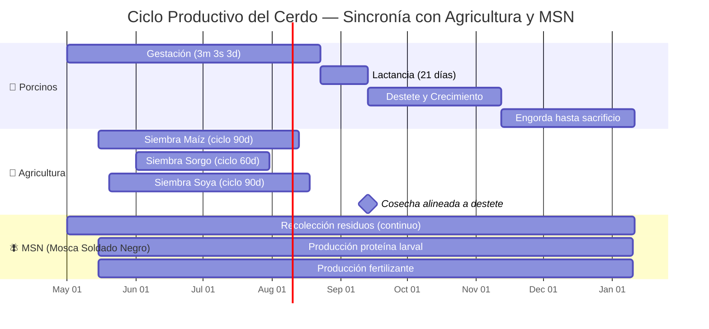
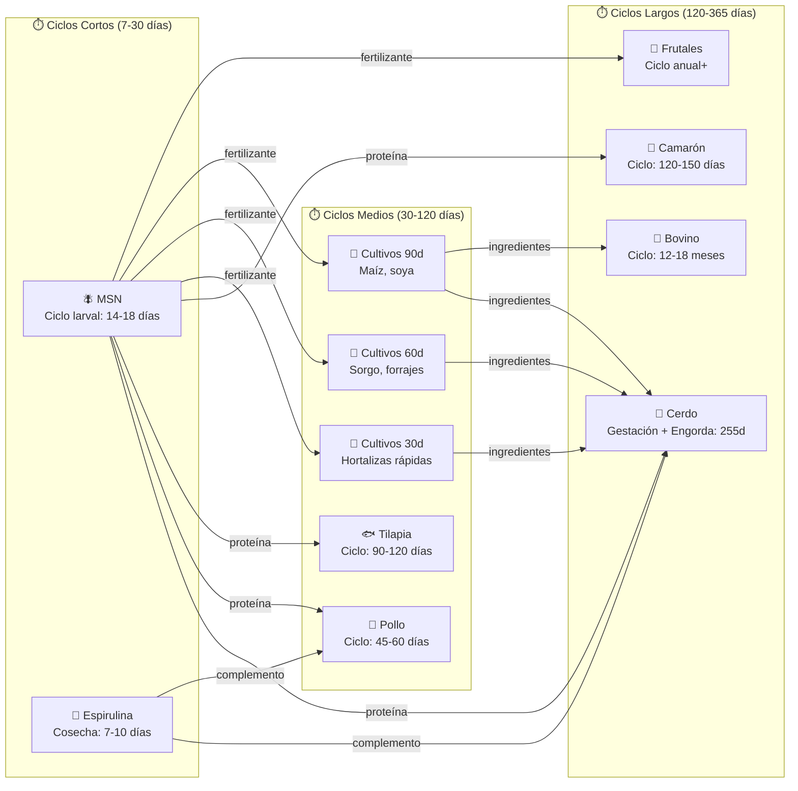
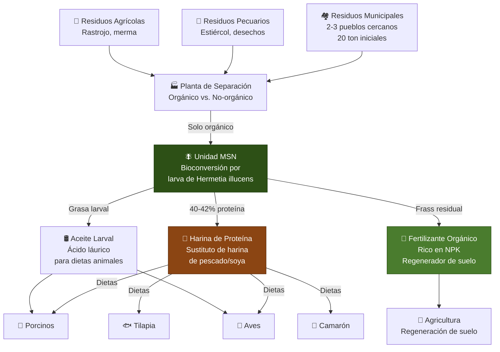
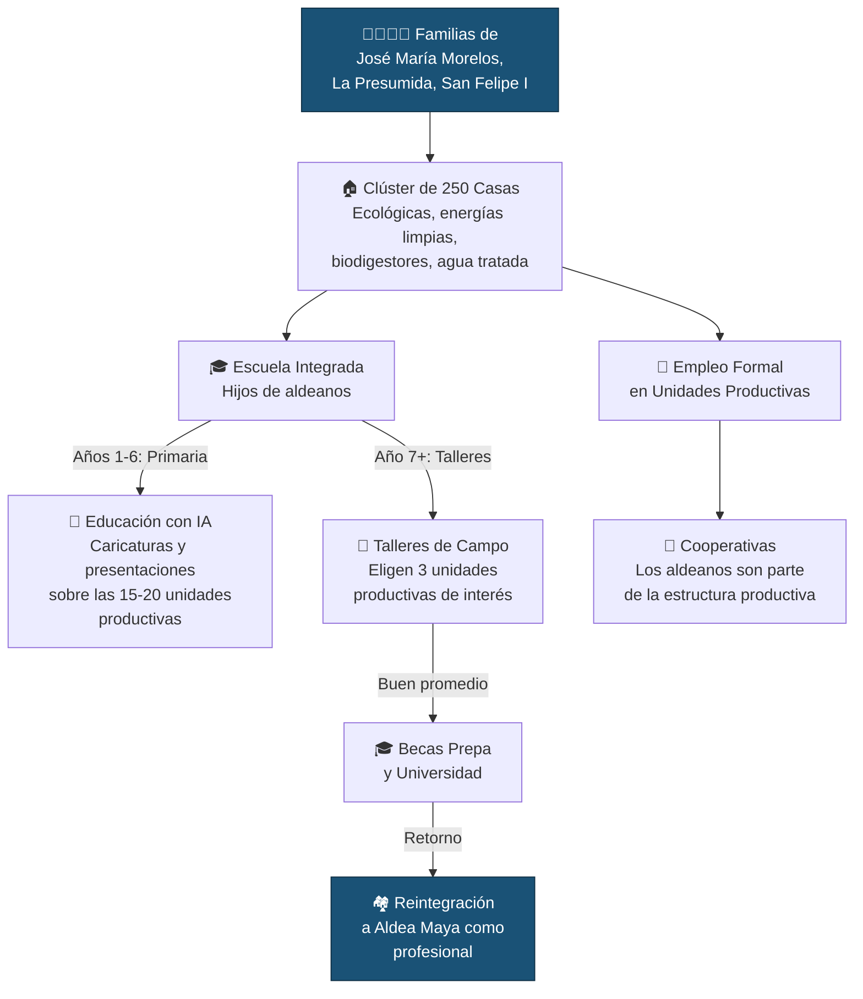

# 🌾 01 — Sincronía Biológica y Operativa

> *"Entendemos el campo mejor que cualquier software factory."*

---

## 1. El Reloj Biológico Manda

Aldea Maya no opera con sprints de software. Opera con **ciclos biológicos** que no esperan, no se pausan y no negocian. El Digital Backbone existe para servir a estos relojes — no al revés.

### 1.1 El Ciclo del Lechón: 3 Meses, 3 Semanas, 3 Días

Este es el reloj maestro que sincroniza la mitad de las unidades productivas de Aldea Maya:



**Lo que el backbone orquesta:**

Cuando el asistente virtual de gestación registra que una cerda fue preñada, el backbone:

1. Calcula la fecha de nacimiento (114 días después)
2. Estima 10-14 lechones por camada
3. Notifica a **Agricultura** para que inicie los ciclos de siembra de ingredientes (maíz 90d, sorgo 60d, soya 90d)
4. Notifica a **MSN** para que incremente la producción de proteína larval proporcional al número de cabezas
5. Notifica a **Espirulina** para complemento nutricional
6. Registra todo para la **auditoría mensual** del fondo

> **Regla de negocio**: Los cultivos de 30, 60 y 90 días deben estar asignados y en producción ANTES de que nazca el lechón. El backbone no permite que un ciclo de gestación avance sin confirmación de abastecimiento de ingredientes.

---

### 1.2 Mapa de Ciclos Biológicos Interconectados



---

## 2. Optimización de Proteína MSN: El Pivote de la Economía Circular

La Mosca Soldado Negro (Hermetia illucens) no es una unidad productiva más. Es el **pivote central** de la economía circular de Aldea Maya.

### 2.1 Flujo de Transformación MSN



### 2.2 Por Qué MSN Es el Pivote

| Dimensión | Impacto |
|-----------|---------|
| **Económica** | Reduce costo de proteína animal en 30-50% vs. harina de pescado importada |
| **Circular** | Convierte residuo municipal (costo negativo) en insumo productivo (ingreso) |
| **Ambiental** | Cada tonelada de residuo procesado = reducción medible de emisiones |
| **Social** | Alianza con gobierno municipal para recolección = empleo + limpieza urbana |
| **Escalable** | El ciclo larval de 14-18 días permite escalar producción rápidamente |

### 2.3 Lo Que el Backbone Orquesta en MSN

- Volumen de residuo recolectado vs. capacidad de procesamiento
- Producción de proteína vs. demanda de las unidades pecuarias
- Producción de fertilizante vs. necesidad de los ciclos agrícolas
- Trazabilidad completa: del residuo municipal al plato del animal
- Métricas de circularidad para reporte al fondo y certificaciones

> **Regla de negocio**: La producción de MSN debe escalar proporcionalmente al número de cabezas en las unidades pecuarias. El backbone calcula y proyecta esta demanda automáticamente.

---

## 3. Impacto Social Estructural: La Dignidad del Aldeano

Aldea Maya no contrata mano de obra. **Integra familias a un ecosistema productivo.**

### 3.1 Modelo de Integración Social



### 3.2 Lo Que el Backbone Digitaliza

La "dignidad del aldeano" no es un eslogan. Es un conjunto de métricas que el backbone captura y reporta:

| Indicador | Captura | Reporte |
|-----------|---------|---------|
| Empleo formal generado | Registro de contratos y cooperativas | Trimestral al fondo |
| Retención escolar | Asistencia y rendimiento en escuela integrada | Semestral |
| Capacitación técnica | Horas de formación por aldeano | Mensual |
| Ingreso familiar | Flujo de compensación por cooperativa | Mensual |
| Vivienda digna | Ocupación del clúster, servicios activos | Trimestral |
| Migración evitada | Permanencia territorial vs. baseline regional | Anual |

### 3.3 Edge AI: Interfaces de Captura Simplificadas

Los aldeanos no son usuarios de software. Son operadores de campo que necesitan **interfaces que no estorben**:

- Asistentes virtuales de voz en español regional (maya-español donde aplique)
- Captura por voz: "Ya parió la cerda 47, tuvo 12 lechones"
- El asistente traduce a datos estructurados y alimenta el sistema de la unidad productiva
- Sin pantallas complejas, sin formularios, sin capacitación de semanas
- Funciona offline (edge) y sincroniza cuando hay conexión

> **Regla de negocio**: Si un aldeano necesita más de 30 segundos para registrar un dato, la interfaz está mal diseñada. El backbone se adapta al campo, no el campo al backbone.

---

## 4. Gobernanza y Transparencia

### 4.1 Trazabilidad para el Fondo

Cada dato capturado en campo tiene una línea directa hasta el reporte de auditoría:

```
Aldeano registra dato → Asistente Virtual valida → Sistema de Unidad Productiva
    → Bus de Orquestación → Agregación Financiera → Dashboard del Fondo
```

### 4.2 SDD (Spec-Driven Development)

Cada flujo de sincronía biológica está documentado como especificación antes de ser código. Esto significa que:

- El fondo puede auditar la lógica de negocio sin leer código
- Cualquier despacho de TI puede implementar a partir de la especificación
- Aldea Maya es dueña del conocimiento, no del proveedor

---

*Documento vivo. Versión 0.1 — Sprint 0, Abril 2026*
*BeInCloud — Arquitectos de Sistemas Nerviosos Territoriales*
