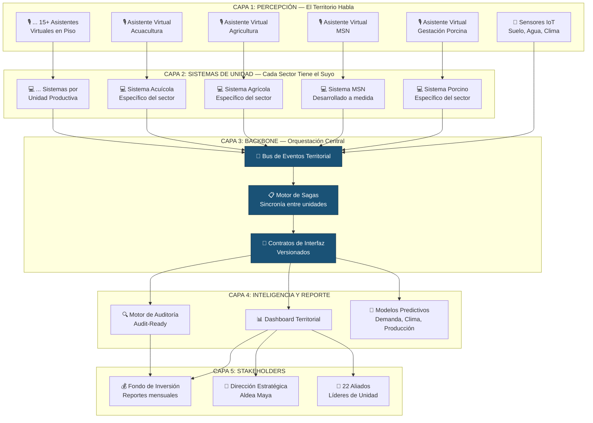
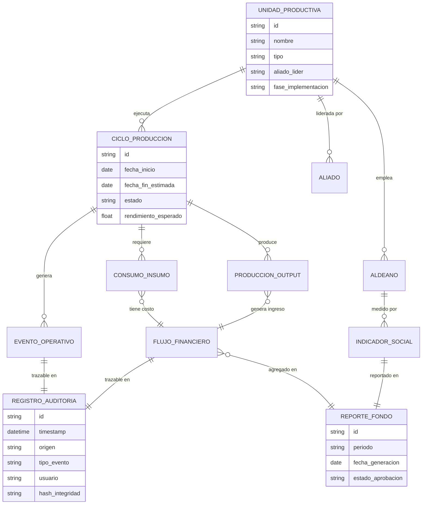
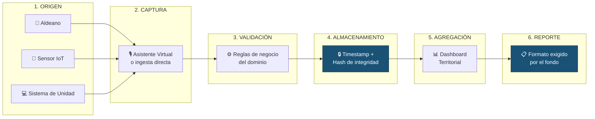
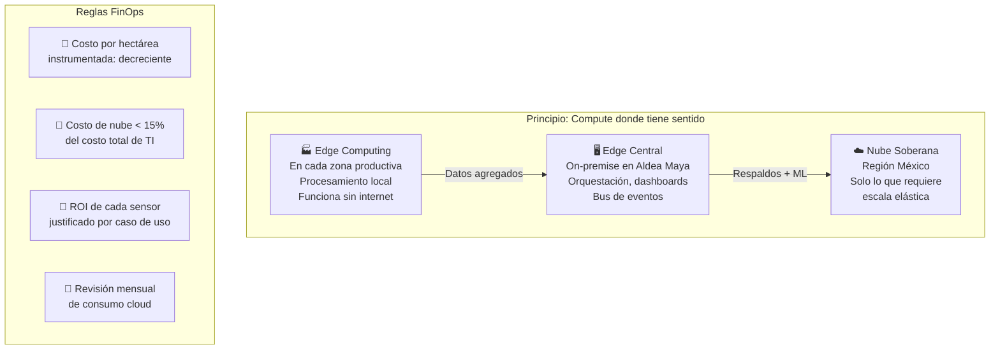
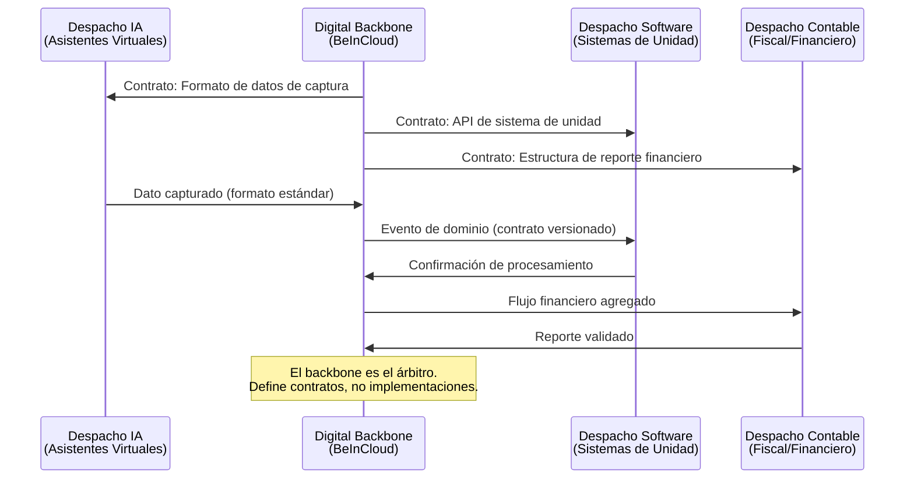

# 🏗️ 02 — Arquitectura de Datos y Transparencia

> *"Dar seguridad técnica al fondo de inversión estadounidense — sin hablar de tecnología."*

---

## 1. Digital Backbone: Motor de Orquestación

### 1.1 El Problema Real

Aldea Maya arranca con 20+ unidades productivas, 22 aliados especializados, múltiples despachos de TI y un fondo de inversión que exige auditorías mensuales. Sin un backbone:

- Cada unidad productiva opera en su propio silo
- La información viaja por WhatsApp y se pierde
- Los reportes al fondo se construyen manualmente y llegan tarde
- Escalar a franquicia es imposible porque no hay estándares
- La coordinación entre despachos de TI representa el reto operativo más complejo del proyecto

### 1.2 Arquitectura de Orquestación

### 1.3 Principio de Interfaz, No de Reemplazo

El backbone **no reemplaza** los sistemas de cada unidad productiva. Los **conecta**.

| Escenario | Acción del Backbone |
|-----------|---------------------|
| La unidad ya tiene sistema (ej: porcinos) | Crear interfaz con el sistema existente |
| La unidad no tiene sistema (ej: MSN) | Especificar y desarrollar el sistema |
| El sistema es Excel o papel | Asistente virtual captura y alimenta un sistema nuevo |
| Múltiples despachos de TI trabajan en paralelo | El backbone define los contratos de interfaz entre ellos |

> **Regla de negocio**: El asistente virtual alimenta automáticamente el sistema de la unidad productiva. El aldeano no captura datos dos veces. Nunca.

---

## 2. Patrimonio de Datos: Audit-Ready desde el Día 0

### 2.1 El Fondo Exige Auditorías Mensuales

Aldea Maya opera bajo un régimen de auditorías mensuales exigido por el fondo de inversión. El backbone está diseñado para que cada dato sea auditable desde su origen.

### 2.2 Estructura de Datos Territorial

### 2.3 Cadena de Custodia del Dato

Cada dato que entra al backbone tiene una cadena de custodia inmutable:

Cada eslabón de esta cadena es inmutable y auditable. Si un dato llega al reporte del fondo, se puede rastrear hasta el aldeano o sensor que lo originó.

### 2.4 Clasificación de Datos para Auditoría

| Categoría | Ejemplos | Retención | Acceso |
|-----------|----------|-----------|--------|
| **Operativos** | Gestación registrada, cosecha completada, residuo procesado | 7 años | Aliado + Dirección |
| **Financieros** | Costo de insumo, ingreso por venta, flujo de inversión | 10 años | Dirección + Fondo |
| **Sociales** | Empleo generado, asistencia escolar, capacitación | 7 años | Dirección + Fondo |
| **Ambientales** | Calidad de suelo, emisiones evitadas, agua reutilizada | Permanente | Público (anonimizado) |

> **Regla de gobernanza**: Todo dato financiero tiene trazabilidad completa desde el evento operativo que lo originó hasta el reporte al fondo. Sin excepciones. Sin atajos.

---

## 3. FinOps desde el Día 0

### 3.1 El Problema de Costos en Proyectos de Esta Escala

Un proyecto de 5-6 años con 20+ unidades productivas puede generar costos de infraestructura digital descontrolados si no se gobiernan desde el inicio.

### 3.2 Estrategia de Control de Costos

### 3.3 Modelo de Costos por Capa

| Capa | Tipo de Costo | Estrategia |
|------|---------------|------------|
| **Edge Zonal** | CapEx (hardware) + OpEx mínimo | Dispositivos robustos, bajo consumo, larga vida útil |
| **Edge Central** | CapEx (servidor on-premise) | Amortizable, sin costos recurrentes de nube |
| **Nube Soberana** | OpEx (pay-as-you-go) | Solo para ML, respaldos y picos de demanda |
| **Conectividad** | OpEx | Red mesh entre zonas, satelital como respaldo |
| **Asistentes Virtuales** | OpEx (modelos de IA) | Modelos edge-first, nube solo para entrenamiento |

### 3.4 Transparencia de Costos para el Fondo

El dashboard del fondo incluye una sección de FinOps que muestra:

- Costo total de TI por mes
- Costo por unidad productiva instrumentada
- Costo por hectárea gestionada
- Tendencia de costo (debe ser decreciente por unidad)
- Comparativa: costo de TI vs. valor habilitado

> **Regla de negocio**: Si el costo de TI por hectárea no decrece trimestre a trimestre, hay un problema de arquitectura que BeInCloud debe resolver. Sin excusas.

---

## 4. Interoperabilidad entre Despachos de TI

### 4.1 El Reto de la Coordinación

Aldea Maya enfrenta el reto de coordinar múltiples despachos de TI especializados trabajando en paralelo — posiblemente la dimensión más compleja de todo el proyecto. El backbone resuelve esto con **contratos de interfaz**:

### 4.2 Estándares de Interoperabilidad

| Estándar | Propósito | Beneficio |
|----------|-----------|-----------|
| Eventos CloudEvents v1.0 | Formato de eventos entre sistemas | Cualquier despacho puede consumir/producir |
| APIs OpenAPI 3.1 | Contratos de interfaz de sistemas | Documentación automática, validación |
| Datos GeoJSON | Información geoespacial del territorio | Mapas, zonas, parcelas estandarizadas |
| OpenTelemetry | Métricas y observabilidad | Visibilidad unificada de todos los sistemas |

> **Regla de gobernanza (SDD)**: Cada contrato de interfaz se especifica ANTES de que cualquier despacho escriba código. La especificación es el activo. El código es la implementación.

---

*Documento vivo. Versión 0.1 — Sprint 0, Abril 2026*
*BeInCloud — Arquitectos de Sistemas Nerviosos Territoriales*
