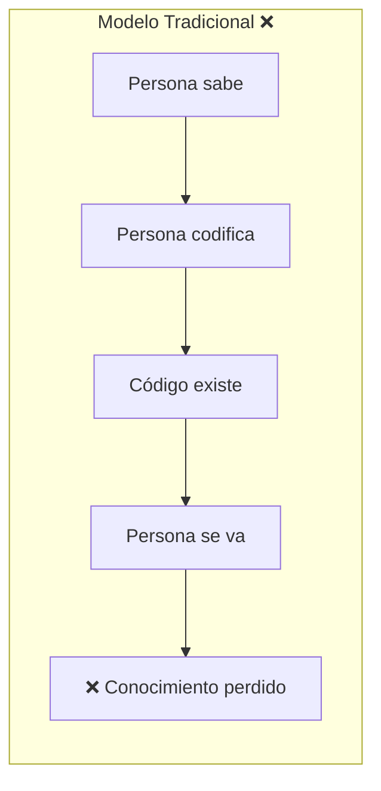
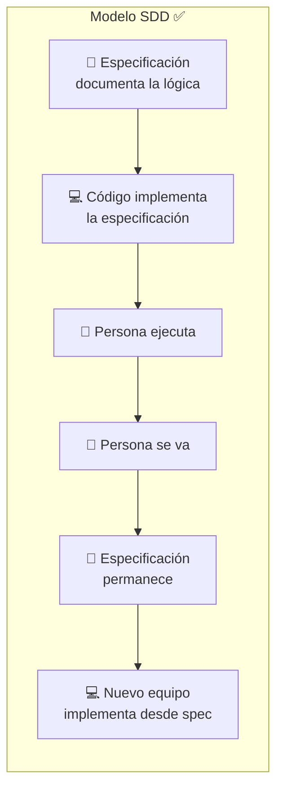
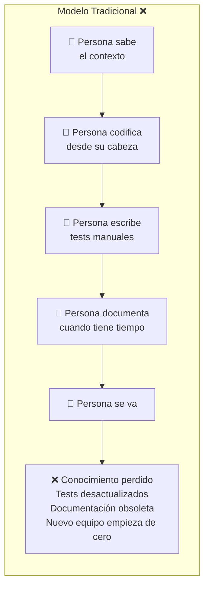
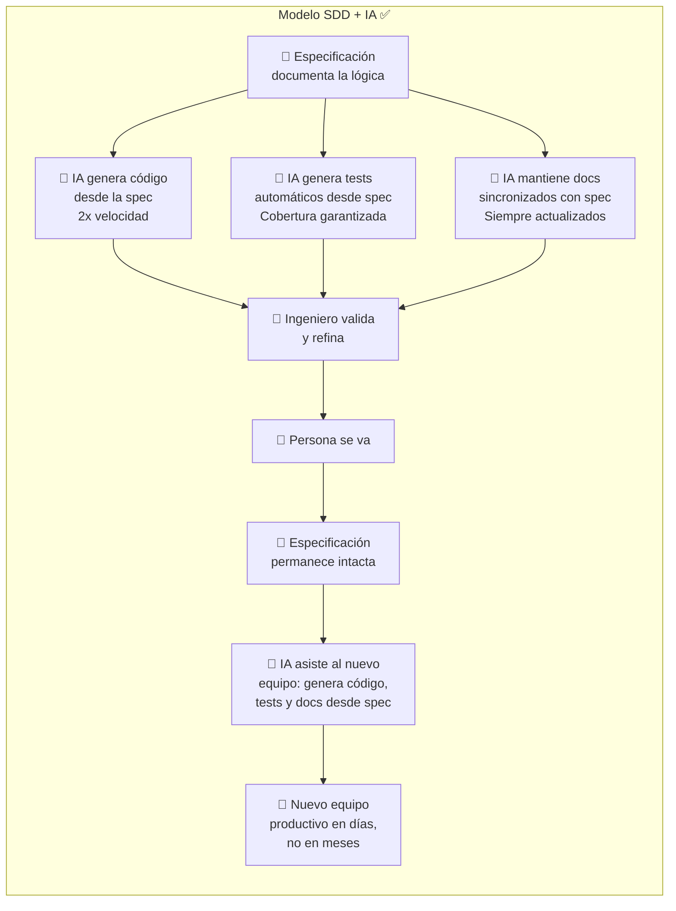
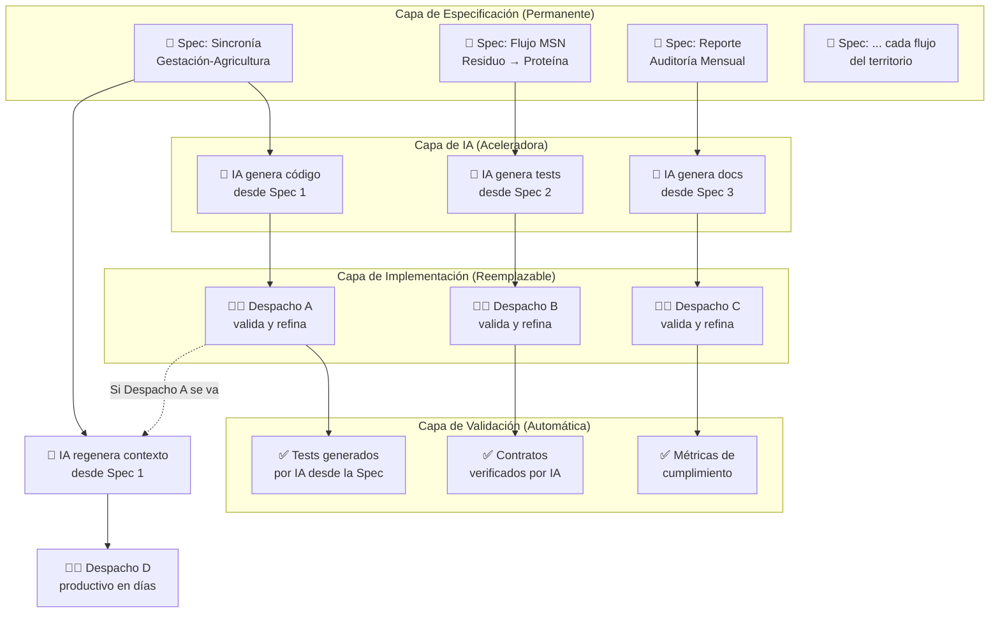
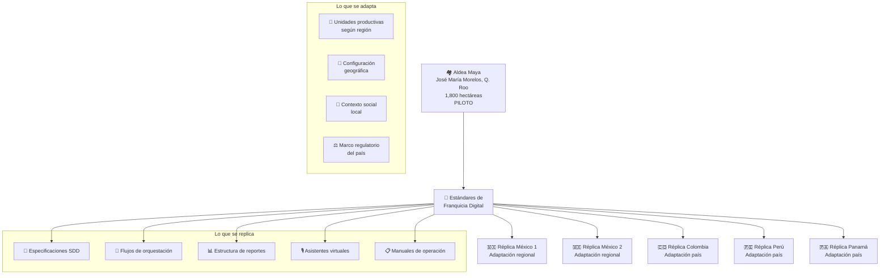
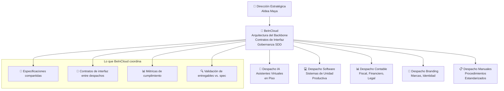

# 📜 03 — Software como Activo Financiero (SDD)

> *"La especificación técnica es más valiosa que el código mismo."*

---

## 1. Gobernanza de Activos Digitales

### 1.1 El Problema que Resuelve SDD

En un proyecto de 5-6 años con múltiples despachos de TI, el riesgo más grande no es técnico — es **la pérdida de conocimiento**. Cuando un despacho se va, se lleva el conocimiento. Cuando una persona renuncia, se lleva el contexto. Cuando cambia la tecnología, el código se vuelve legacy.

**Spec-Driven Development (SDD)** invierte esta ecuación:





### 1.2 La Especificación Es el Activo — Y la IA la Potencia

| Componente | ¿Quién lo posee? | ¿Es reemplazable? | Rol de la IA |
|------------|:-----------------:|:------------------:|:------------:|
| Especificación de negocio | **Aldea Maya** (perpetuo) | No — es el conocimiento del territorio | IA asiste en redacción, validación de consistencia y detección de conflictos entre specs |
| Código fuente | **Aldea Maya** (perpetuo) | Sí — se puede reimplementar desde la spec | IA genera código a partir de la spec, acelera 2x la velocidad de entrega |
| Tests y QA | **Aldea Maya** (perpetuo) | Sí — se regeneran desde la spec | IA genera tests automáticos desde la spec, valida cobertura y detecta regresiones |
| Documentación | **Aldea Maya** (perpetuo) | Sí — se regenera desde la spec | IA mantiene documentación sincronizada con la spec en todo momento |
| Equipo de desarrollo | Despacho de TI (temporal) | Sí — cualquier equipo puede continuar | IA reduce la curva de onboarding: el nuevo equipo consulta la spec asistido por IA |
| Infraestructura | Proveedor cloud (intercambiable) | Sí — arquitectura sin vendor lock-in | IA optimiza costos (FinOps) y sugiere configuraciones |

### 1.3 Modelo Tradicional vs. SDD con IA





### 1.4 Impacto de la IA en Cada Fase del Ciclo

| Fase | Sin IA | Con IA sobre SDD | Beneficio si la persona se va |
|------|--------|-------------------|-------------------------------|
| **Desarrollo** | El dev interpreta requerimientos ambiguos y codifica desde su experiencia | La IA transforma la spec en código base; el dev refina y valida | El código se regenera desde la spec — no depende de la memoria del dev anterior |
| **QA / Testing** | Tests manuales, cobertura inconsistente, se desactualizan rápido | La IA genera tests automáticos desde la spec, detecta regresiones al cambiar specs | Los tests se regeneran automáticamente — no se pierden con la rotación de QA |
| **Documentación** | Se escribe al final (o nunca), se desactualiza inmediatamente | La IA genera y actualiza documentación en tiempo real desde la spec | La documentación nunca se desactualiza — siempre refleja la spec vigente |
| **Onboarding** | Semanas o meses para que un nuevo dev entienda el sistema | El nuevo dev consulta la spec asistido por IA, recibe contexto inmediato | Tiempo de onboarding reducido de semanas a días |
| **Auditoría** | Reportes manuales, propensos a error, costosos | La IA genera reportes de cumplimiento spec vs. implementación automáticamente | La auditoría no depende de ninguna persona — es un proceso automatizado |

> **Regla de gobernanza**: Aldea Maya es dueña perpetua de todas las especificaciones, código fuente y datos. Ningún despacho, incluyendo BeInCloud, retiene propiedad intelectual sobre el backbone.

---

## 2. Eliminación del "Riesgo de Persona"

### 2.1 El Riesgo Identificado por Aldea Maya

La Dirección Estratégica de Aldea Maya estableció una premisa clara: *"No podemos depender de una persona. Ese es un hecho."*

SDD elimina este riesgo de forma estructural:



### 2.2 Ciclo de Vida SDD

Cada funcionalidad del backbone sigue este ciclo:

```
1. ESPECIFICAR  → Documentar la lógica de negocio en formato estándar
2. VALIDAR      → El dueño de negocio (aliado / Dirección Estratégica) aprueba la spec
3. IMPLEMENTAR  → El despacho asignado codifica a partir de la spec
4. VERIFICAR    → Tests automáticos validan que el código cumple la spec
5. AUDITAR      → La spec + código + tests son auditables por el fondo
6. EVOLUCIONAR  → Cambios empiezan en la spec, nunca en el código
```

### 2.3 Formato de Especificación

Cada spec del backbone incluye:

| Sección | Contenido | Audiencia |
|---------|-----------|-----------|
| **Contexto de negocio** | Por qué existe este flujo, qué problema resuelve | Fondo, Dirección Estratégica |
| **Reglas de negocio** | Invariantes que nunca se pueden violar | Todos |
| **Flujo de orquestación** | Diagrama de secuencia entre unidades | Despachos de TI |
| **Contrato de datos** | Estructura exacta de entrada/salida | Despachos de TI |
| **SLA de negocio** | Tiempos de respuesta definidos por el negocio | Todos |
| **Criterios de aceptación** | Cómo se verifica que funciona | QA + Fondo |
| **Métricas de auditoría** | Qué se reporta y con qué frecuencia | Fondo |

---

## 3. Estándares de Franquicia: Replicabilidad desde el Día 0

### 3.1 La Visión de Replicabilidad

Aldea Maya no es un proyecto único. Es el **modelo piloto** de una franquicia replicable a nivel México y Latinoamérica. El backbone se diseña con esta premisa desde el Sprint 0.



### 3.2 Qué Hace Replicable al Backbone

| Componente | Estrategia de Replicabilidad |
|------------|------------------------------|
| **Especificaciones** | Parametrizadas por región (cultivos, especies, clima) |
| **Contratos de interfaz** | Estándar universal, implementación local |
| **Asistentes virtuales** | Mismo motor, vocabulario adaptado por región |
| **Estructura de auditoría** | Formato único para cualquier fondo de inversión |
| **Manuales de operación** | Template estándar, contenido específico por unidad |

### 3.3 El Backbone como Propiedad Intelectual

La combinación de especificaciones SDD + flujos de orquestación + estructura de datos constituye **propiedad intelectual de Aldea Maya** que:

- Tiene valor financiero independiente del código
- Es licenciable a futuras réplicas
- Es auditable por cualquier fondo de inversión
- Es transferible sin dependencia de ningún proveedor

> **Para el fondo**: El backbone no es un gasto de TI. Es un **activo de propiedad intelectual** que se aprecia con cada unidad productiva que se integra y con cada réplica que se licencia.

---

## 4. Gobernanza de Despachos de TI

### 4.1 Modelo de Coordinación

Aldea Maya opera con un ecosistema donde múltiples despachos especializados colaboran en paralelo. SDD es el pegamento:



### 4.2 Protocolo de Precotización

Alineado con el proceso establecido por Aldea Maya:

1. **Acompañamiento**: BeInCloud facilita que cada despacho entienda el alcance completo
2. **NDA**: Información confidencial compartida bajo acuerdo
3. **Precotización por fases**: Números genéricos alineados con las fases de construcción
4. **Contrato detallado**: Conceptos identificados para trazabilidad del recurso
5. **Auditoría mensual**: Verificación de avance vs. contrato vs. especificación

> **Regla de gobernanza**: Ningún despacho empieza a codificar sin una especificación aprobada. La precotización se basa en la spec, no en estimaciones al aire.

---

## 5. Transparencia para Inversionistas

### 5.1 Dashboard de Gobernanza SDD

El fondo tiene acceso a un dashboard que muestra:

| Métrica | Frecuencia | Significado |
|---------|:----------:|-------------|
| Specs completadas vs. planificadas | Semanal | Progreso real del backbone |
| Specs implementadas vs. especificadas | Semanal | Deuda técnica |
| Tests pasando vs. totales | Diario | Calidad del sistema |
| Contratos de interfaz activos | Mensual | Nivel de integración |
| Costo real vs. precotización | Mensual | Control financiero |
| Despachos activos y su cumplimiento | Mensual | Gestión de proveedores |

### 5.2 Garantía para el Fondo

SDD garantiza al fondo que:

- **El conocimiento no se pierde**: Está en las specs, no en las personas
- **El dinero es trazable**: Cada peso invertido en TI tiene una spec que lo justifica
- **El riesgo es medible**: Specs pendientes = riesgo cuantificable
- **La inversión es un activo**: Las specs + código son propiedad de Aldea Maya
- **La replicabilidad es real**: Las specs son el manual de franquicia digital

---

*Documento vivo. Versión 0.1 — Sprint 0, Abril 2026*
*BeInCloud — Arquitectos de Sistemas Nerviosos Territoriales*
