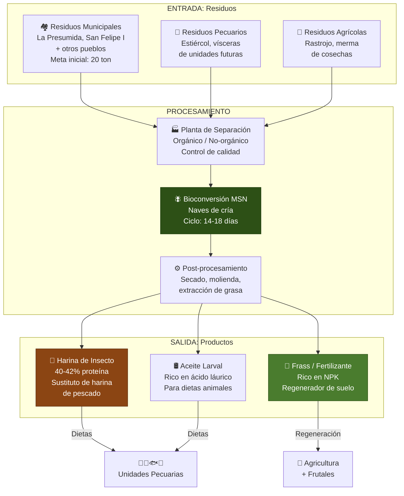
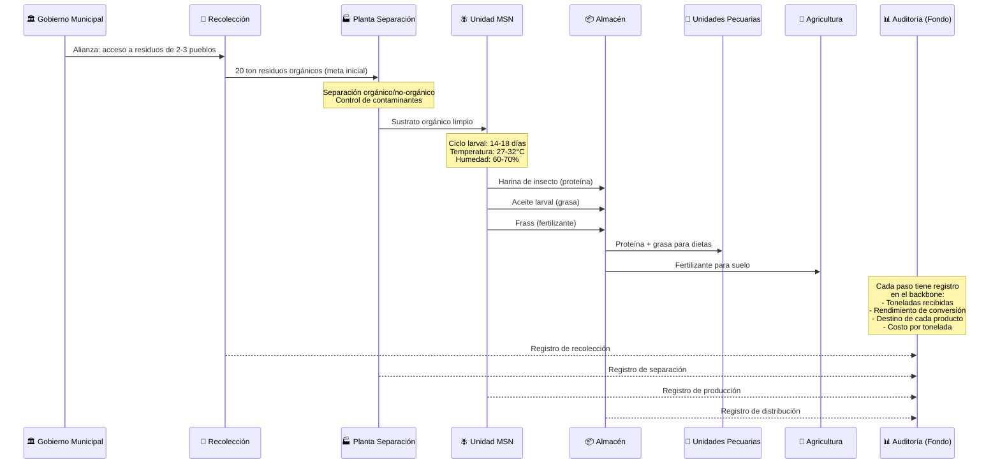
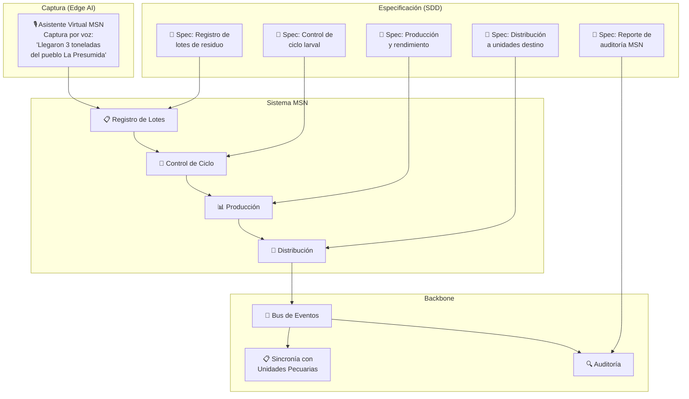
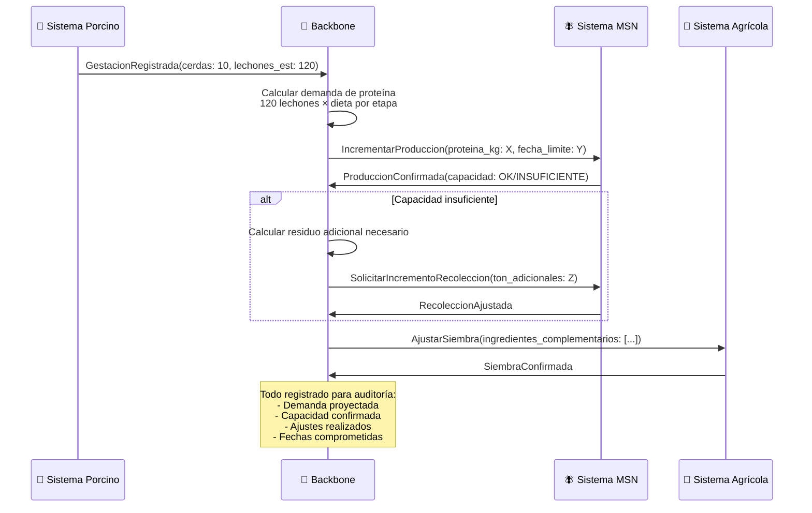
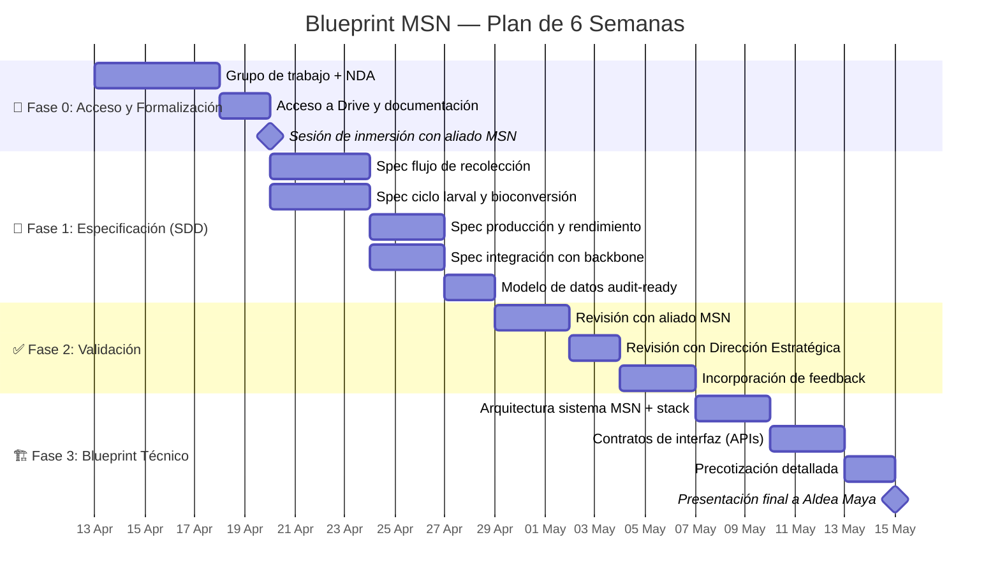
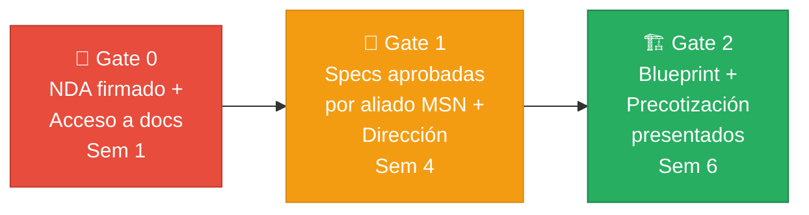
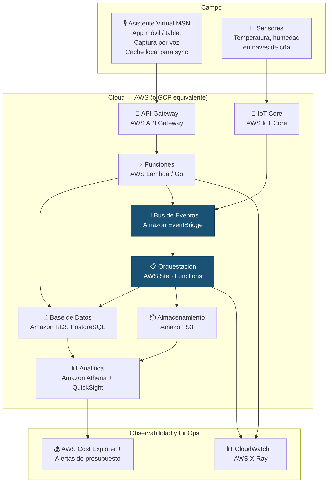
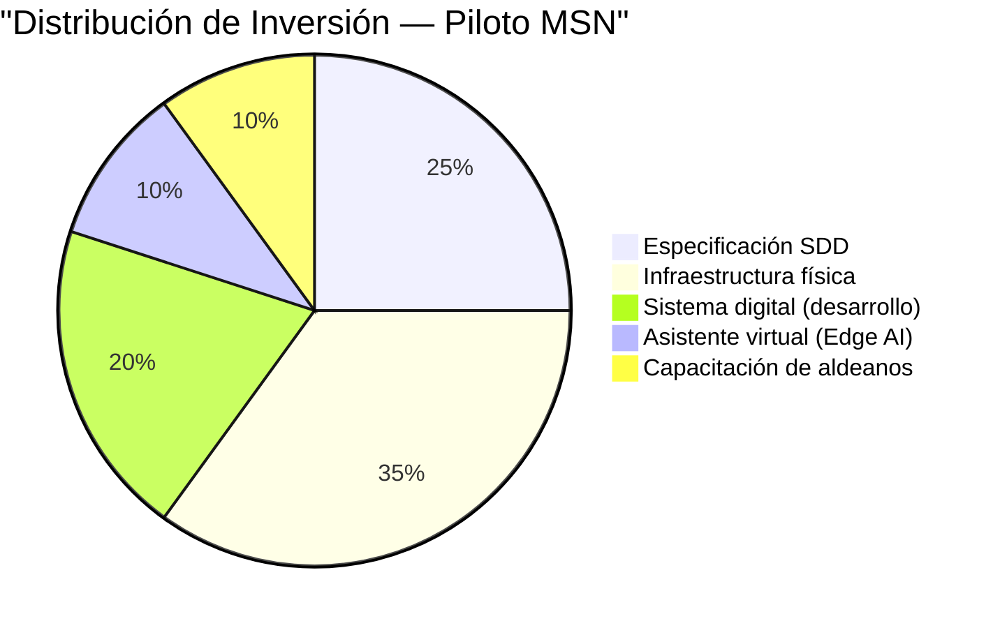

# 🪰 04 — Blueprint del Proyecto Piloto: Unidad de Transformación MSN (Mosca Soldado Negro)

> *"El Land estratégico. Atacar el problema más inmediato y visible."*

---

## 1. El Estándar de Oro: Por Qué Empezamos con MSN

### 1.1 Justificación Estratégica

La Mosca Soldado Negro (Hermetia illucens) es la primera unidad productiva que se activa en Aldea Maya. No es casualidad. Es la decisión más inteligente del roadmap:

| Criterio | Por qué MSN primero |
|----------|---------------------|
| **Ciclo corto** | 14-18 días de ciclo larval vs. 255 días del cerdo. Resultados rápidos. |
| **Pivote circular** | Conecta residuos municipales con proteína animal y fertilizante. Sin MSN, no hay economía circular. |
| **Bajo riesgo** | Inversión inicial moderada, tecnología probada, mercado creciente. |
| **Alta visibilidad** | Transforma un problema visible (basura municipal) en un producto de valor. |
| **Demuestra el modelo** | Si MSN funciona orquestada por el backbone, el mismo patrón se replica en las demás unidades. |
| **No tiene sistema** | Es la oportunidad perfecta para que BeInCloud demuestre SDD desde cero. |

### 1.2 MSN en el Contexto de Aldea Maya

---

## 2. Flujo de Captura: Del Residuo Municipal al Fertilizante Orgánico

### 2.1 Cadena de Valor Completa

### 2.2 Métricas Clave del Flujo MSN

| Métrica | Unidad | Meta Inicial | Meta Año 1 |
|---------|--------|:------------:|:----------:|
| Residuo recolectado | Toneladas/mes | 20 | 80 |
| Tasa de conversión | % peso seco | 20-25% | 25-30% |
| Proteína producida | Toneladas/mes | 4-5 | 20-24 |
| Fertilizante producido | Toneladas/mes | 10-12 | 40-48 |
| Costo por kg de proteína | USD/kg | A establecer | -30% vs. harina de pescado |
| Empleos directos | Personas | 8-12 | 25-35 |

---

## 3. Lo Que el Backbone Orquesta en el Blueprint MSN

### 3.1 Sistema MSN: Desarrollado desde Cero con SDD

La MSN no tiene sistema existente. Es la oportunidad de demostrar el modelo SDD completo:

### 3.2 Eventos de Dominio MSN

| Evento | Trigger | Consumidores | Acción |
|--------|---------|--------------|--------|
| `LoteResiduoRecibido` | Llegada de residuo a planta | Separación, Auditoría | Registrar origen, peso, calidad |
| `SustratoListo` | Separación completada | Unidad MSN | Asignar a nave de cría |
| `CicloLarvalIniciado` | Larvas depositadas en sustrato | Control de ciclo | Iniciar monitoreo de T° y humedad |
| `CosechaLarvalLista` | Ciclo de 14-18 días completado | Post-procesamiento | Iniciar secado y molienda |
| `ProteínaDisponible` | Harina de insecto lista | Unidades Pecuarias, Almacén | Notificar disponibilidad para dietas |
| `FertilizanteDisponible` | Frass procesado | Agricultura, Almacén | Notificar disponibilidad para suelo |
| `RendimientoCalculado` | Fin de lote completo | Auditoría, Fondo | Reportar conversión y costos |

### 3.3 Sincronía MSN ↔ Porcinos (El Primer Flujo de Orquestación)

---

## 4. Plan de Ejecución: 8 Semanas con Dependencias Reales

### 4.1 Gantt del Blueprint MSN (Mosca Soldado Negro)

### 4.2 Dependencias Críticas y Riesgos del Timeline

| Dependencia | De quién depende | Riesgo si se retrasa | Mitigación |
|-------------|:----------------:|:--------------------:|------------|
| Firma de NDA | Legal de ambas partes | Bloquea acceso a información confidencial | Iniciar proceso legal en paralelo con grupo de trabajo |
| Acceso al Drive | Aldea Maya | Sin documentación no se puede especificar | Solicitar acceso parcial mientras se formaliza NDA |
| Sesión con aliado MSN (Mosca Soldado Negro) | Disponibilidad del líder especialista | Specs sin validación de campo | Agendar desde Semana 1 para asegurar slot |
| Revisión de Dirección Estratégica | Disponibilidad de la dirección | Blueprint sin aprobación estratégica | Enviar specs para revisión asíncrona, sesión solo para dudas |

> **Nota sobre el timeline**: Las 6 semanas contemplan 4 semanas de trabajo efectivo de BeInCloud + 2 semanas de buffer por dependencias de Aldea Maya (firmas, accesos, agendas). Si Aldea Maya se mueve rápido en la formalización, el blueprint puede estar listo antes.

### 4.3 Gates de Aprobación

El plan tiene tres gates donde se requiere aprobación explícita antes de avanzar:

---

## 5. Stack Tecnológico Propuesto

Esta sección detalla las tecnologías recomendadas para el sistema MSN (Mosca Soldado Negro). Cada elección se justifica por su impacto en el negocio, no por preferencia técnica.

### 5.1 Supuesto de Conectividad

Se asume que Aldea Maya contará con conectividad a internet como parte de su infraestructura de ciudadela (energías limpias, agua tratada, vivienda — la conectividad es un servicio más). El stack se diseña **cloud-first**.

> **Nota**: En caso de que la conectividad sea limitada o intermitente en fases tempranas de construcción, existen opciones de tolerancia a desconexión (cache local en dispositivos de captura, sincronización diferida) que se pueden incorporar sin cambiar la arquitectura base. Esto se evaluará durante el acompañamiento con Aldea Maya en las primeras semanas.

### 5.2 Arquitectura del Sistema MSN — Cloud-First

### 5.3 Justificación de Cada Componente

| Componente | Servicio AWS | Equivalente GCP | Por qué |
|------------|-------------|-----------------|---------|
| **API Gateway** | API Gateway | Cloud Endpoints | Punto de entrada único, autenticación, throttling — managed, sin servidores |
| **Lógica de negocio** | Lambda (Go) | Cloud Functions | Serverless, paga solo por uso, Go es el foco de BeInCloud |
| **Base de datos** | RDS PostgreSQL | Cloud SQL | Relacional managed, sin DBA, backups automáticos, escalable |
| **Bus de eventos** | EventBridge | Pub/Sub | Desacopla servicios, enruta eventos entre dominios, managed |
| **Orquestación** | Step Functions | Workflows | Sagas multi-paso (recolección → bioconversión → distribución), compensación automática |
| **Almacenamiento** | S3 | Cloud Storage | Documentos, specs, respaldos, datos históricos — costo mínimo |
| **Analítica / Reportes** | Athena + QuickSight | BigQuery + Looker | Consultas SQL sobre datos en S3, dashboards de auditoría — sin infraestructura |
| **IoT (sensores)** | IoT Core | IoT Core | Ingesta de datos de sensores de naves de cría — managed, escalable |
| **Observabilidad** | CloudWatch + X-Ray | Cloud Monitoring | Logs, métricas, traces — visibilidad total sin herramientas externas |
| **FinOps** | Cost Explorer + Budgets | Billing + Budgets | Control de costos en tiempo real, alertas automáticas |

### 5.4 Principios de Selección

| Principio | Aplicación |
|-----------|------------|
| **Managed-first** | Cero servidores que mantener. Todo serverless o managed. Menos ops, más negocio. |
| **Cloud-first** | Se asume conectividad. El cloud es el centro, no el edge. |
| **FinOps nativo** | Cada servicio tiene costo predecible y medible. Alertas desde el día 0. |
| **Serverless donde sea posible** | Lambda + Step Functions + EventBridge = paga solo lo que usas |
| **Sin vendor lock-in en la lógica** | La lógica de negocio está en las specs (SDD), no en servicios propietarios. Migrar de AWS a GCP es cambiar infraestructura, no reescribir negocio. |

> **Regla de negocio**: Ninguna tecnología se selecciona por tendencia o preferencia. Cada componente tiene una justificación de negocio. Si no la tiene, no entra.

→ Ver detalle de capacidades técnicas de BeInCloud: [`assets/beincloud-profile.md`](./assets/beincloud-profile.md)

---

## 6. Gobernanza y Transparencia del Piloto

### 6.1 Reporte al Fondo — Piloto MSN (Mosca Soldado Negro)

El piloto MSN genera el primer reporte de auditoría real del backbone:

### 6.2 KPIs del Piloto

| KPI | Definición | Frecuencia |
|-----|------------|:----------:|
| Toneladas procesadas | Residuo convertido en producto | Semanal |
| Costo por kg de proteína | Competitividad vs. mercado | Mensual |
| Tasa de conversión | Eficiencia del proceso biológico | Por lote |
| Empleos generados | Impacto social directo | Mensual |
| Trazabilidad | % de flujos con registro completo | Mensual |
| Tiempo de reporte | Días entre cierre de mes y reporte listo | Mensual |

> El piloto MSN (Mosca Soldado Negro) es la prueba de concepto del modelo completo. Si funciona aquí — con trazabilidad, auditoría y orquestación — el mismo patrón se aplica a las 20+ unidades restantes.

---

## 7. Criterios de Éxito del Blueprint

- [ ] El aliado MSN puede leer la spec y confirmar que refleja su operación real
- [ ] El blueprint permite entender el flujo de inversión sin conocimiento técnico
- [ ] Cualquier despacho de TI puede tomar el blueprint e implementar sin depender de BeInCloud
- [ ] Los contratos de interfaz (APIs) permiten integración futura con porcinos, agricultura, etc.
- [ ] Las métricas de auditoría están definidas y son medibles desde el día 1
- [ ] El stack tecnológico está justificado por negocio, no por preferencia técnica

---

## Navegación

| Anterior | Siguiente |
|:--------:|:---------:|
| [← 03 — SDD + IA](./03-sdd-methodology.md) | [05 — Propuesta de Socio →](./05-roadmap-economics.md) |

→ Para entender la sincronía biológica que MSN habilita: [`01-business-alignment.md`](./01-business-alignment.md)
→ Para ver la arquitectura de datos donde MSN se integra: [`02-architecture-ecosystem.md`](./02-architecture-ecosystem.md)
→ Para conocer a BeInCloud: [`assets/beincloud-profile.md`](./assets/beincloud-profile.md)

---

*Documento vivo. Versión 0.2 — Sprint 0, Abril 2026*
*Be In Cloud Group LLC — Ingeniería Cloud con Visión Financiera*
