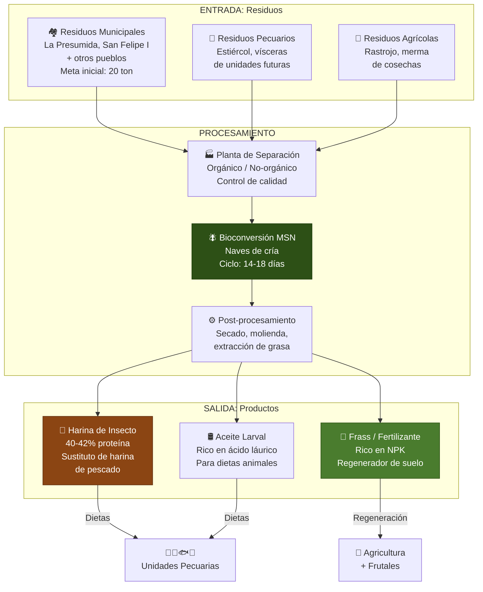
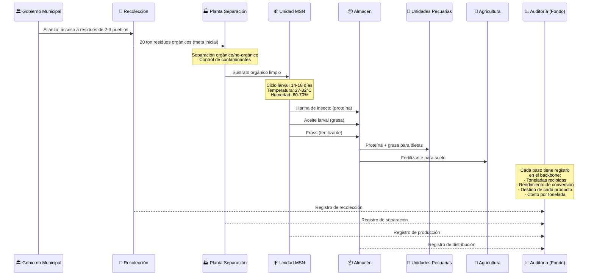
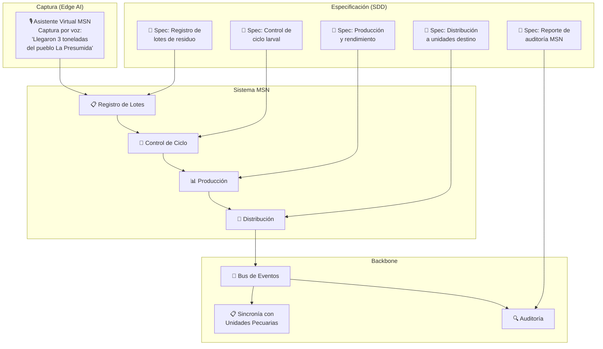
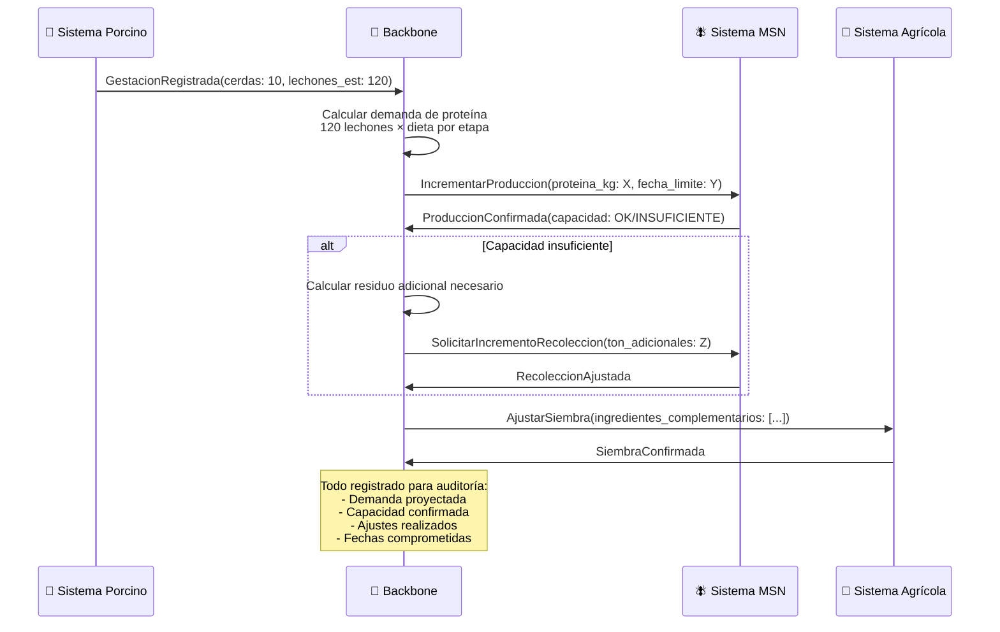
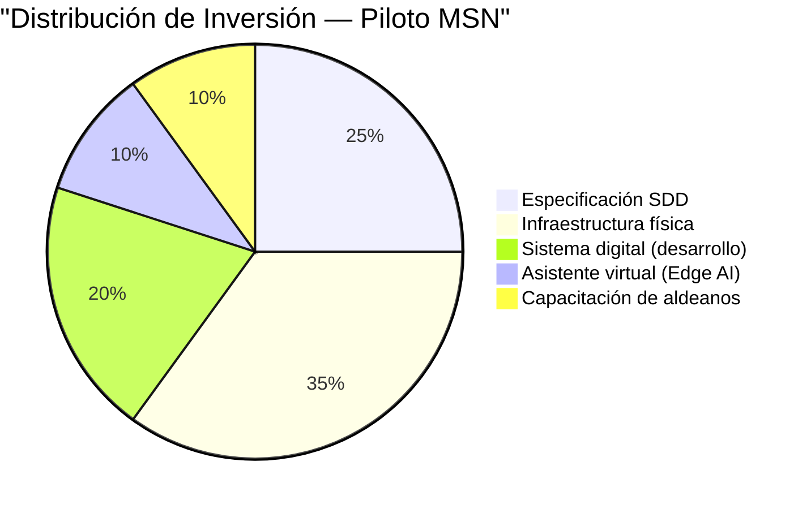

# 🪰 04 — Blueprint del Proyecto Piloto: Unidad de Transformación MSN

> *"El Land estratégico. Atacar el problema más inmediato y visible."*

---

## 1. El Estándar de Oro: Por Qué Empezamos con MSN

### 1.1 Justificación Estratégica

La Mosca Soldado Negro (Hermetia illucens) es la primera unidad productiva que se activa en Aldea Maya. No es casualidad. Es la decisión más inteligente del roadmap:

| Criterio | Por qué MSN primero |
|----------|---------------------|
| **Ciclo corto** | 14-18 días de ciclo larval vs. 255 días del cerdo. Resultados rápidos. |
| **Pivote circular** | Conecta residuos municipales con proteína animal y fertilizante. Sin MSN, no hay economía circular. |
| **Bajo riesgo** | Inversión inicial moderada, tecnología probada, mercado creciente. |
| **Alta visibilidad** | Transforma un problema visible (basura municipal) en un producto de valor. |
| **Demuestra el modelo** | Si MSN funciona orquestada por el backbone, el fondo ve el patrón para las demás unidades. |
| **No tiene sistema** | Es la oportunidad perfecta para que BeInCloud demuestre SDD desde cero. |

### 1.2 MSN en el Contexto de Aldea Maya

---

## 2. Flujo de Captura: Del Residuo Municipal al Fertilizante Orgánico

### 2.1 Cadena de Valor Completa

### 2.2 Métricas Clave del Flujo MSN

| Métrica | Unidad | Meta Inicial | Meta Año 1 |
|---------|--------|:------------:|:----------:|
| Residuo recolectado | Toneladas/mes | 20 | 80 |
| Tasa de conversión | % peso seco | 20-25% | 25-30% |
| Proteína producida | Toneladas/mes | 4-5 | 20-24 |
| Fertilizante producido | Toneladas/mes | 10-12 | 40-48 |
| Costo por kg de proteína | USD/kg | A establecer | -30% vs. harina de pescado |
| Empleos directos | Personas | 8-12 | 25-35 |

---

## 3. Lo Que el Backbone Orquesta en el Blueprint MSN

### 3.1 Sistema MSN: Desarrollado desde Cero con SDD

La MSN no tiene sistema existente. Es la oportunidad de demostrar el modelo SDD completo:

### 3.2 Eventos de Dominio MSN

| Evento | Trigger | Consumidores | Acción |
|--------|---------|--------------|--------|
| `LoteResiduoRecibido` | Llegada de residuo a planta | Separación, Auditoría | Registrar origen, peso, calidad |
| `SustratoListo` | Separación completada | Unidad MSN | Asignar a nave de cría |
| `CicloLarvalIniciado` | Larvas depositadas en sustrato | Control de ciclo | Iniciar monitoreo de T° y humedad |
| `CosechaLarvalLista` | Ciclo de 14-18 días completado | Post-procesamiento | Iniciar secado y molienda |
| `ProteínaDisponible` | Harina de insecto lista | Unidades Pecuarias, Almacén | Notificar disponibilidad para dietas |
| `FertilizanteDisponible` | Frass procesado | Agricultura, Almacén | Notificar disponibilidad para suelo |
| `RendimientoCalculado` | Fin de lote completo | Auditoría, Fondo | Reportar conversión y costos |

### 3.3 Sincronía MSN ↔ Porcinos (El Primer Flujo de Orquestación)

---

## 4. Entregable en 4 Semanas: Alcance del Blueprint Técnico

### 4.1 Semana 1-2: Especificación

| Entregable | Descripción |
|------------|-------------|
| Spec de flujo de recolección | Desde alianza municipal hasta planta de separación |
| Spec de ciclo larval | Control de naves, temperatura, humedad, tiempos |
| Spec de producción | Rendimiento, calidad, distribución de productos |
| Spec de integración con backbone | Eventos, contratos, SLAs |
| Modelo de datos MSN | Entidades, relaciones, cadena de custodia |

### 4.2 Semana 3: Validación

| Entregable | Descripción |
|------------|-------------|
| Revisión con aliado MSN | El líder especialista valida la lógica de negocio |
| Revisión con Dirección Estratégica | Alineación con visión estratégica de Aldea Maya |
| Revisión de auditoría | Verificar que cada dato es trazable para el fondo |
| Ajustes a especificaciones | Incorporar feedback |

### 4.3 Semana 4: Blueprint Técnico

| Entregable | Descripción |
|------------|-------------|
| Blueprint de sistema MSN | Arquitectura, componentes, tecnologías recomendadas |
| Contratos de interfaz | APIs y eventos para integración con backbone |
| Plan de implementación | Fases, tiempos, recursos, costos estimados |
| Precotización detallada | Alineada con el proceso de Aldea Maya |

### 4.4 Criterios de Éxito del Blueprint

- [ ] El aliado MSN puede leer la spec y confirmar que refleja su operación
- [ ] El fondo puede leer el blueprint y entender el flujo de inversión
- [ ] Cualquier despacho de TI puede tomar el blueprint e implementar
- [ ] Los contratos de interfaz permiten integración futura con porcinos, agricultura, etc.
- [ ] Las métricas de auditoría están definidas y son medibles

---

## 5. Gobernanza y Transparencia del Piloto

### 5.1 Reporte al Fondo — Piloto MSN

El piloto MSN genera el primer reporte de auditoría real del backbone:

### 5.2 KPIs del Piloto para el Fondo

| KPI | Definición | Frecuencia |
|-----|------------|:----------:|
| Toneladas procesadas | Residuo convertido en producto | Semanal |
| Costo por kg de proteína | Competitividad vs. mercado | Mensual |
| Tasa de conversión | Eficiencia del proceso biológico | Por lote |
| Empleos generados | Impacto social directo | Mensual |
| Trazabilidad | % de flujos con registro completo | Mensual |
| Tiempo de reporte | Días entre cierre de mes y reporte listo | Mensual |

> **Para el fondo**: El piloto MSN es la prueba de concepto del modelo completo. Si funciona aquí — con trazabilidad, auditoría y orquestación — funciona en las 20+ unidades restantes.

---

*Documento vivo. Versión 0.1 — Sprint 0, Abril 2026*
*BeInCloud — Arquitectos de Sistemas Nerviosos Territoriales*
