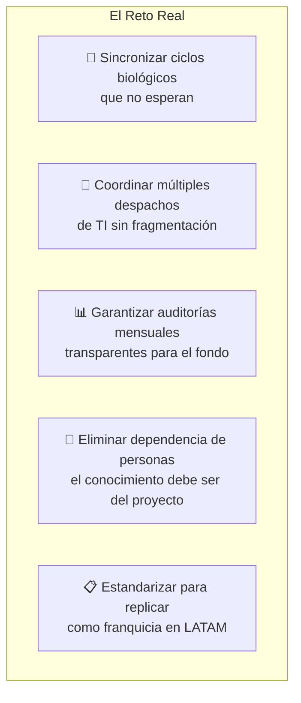
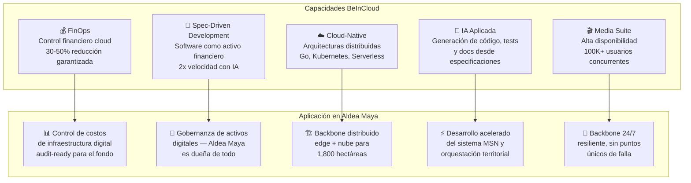
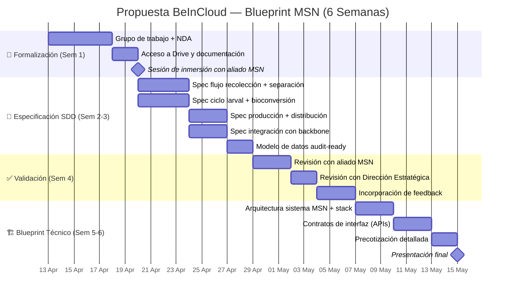
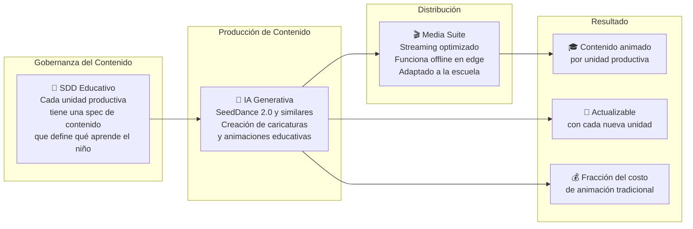
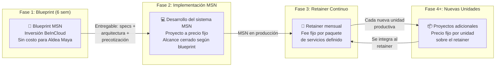

# 📈 05 — Propuesta de Socio Arquitectónico y Modelo de Trabajo

> *"70 clientes en uno. El primer paso es demostrar que entendemos el primero."*

---

## 1. Lo Que Entendimos

Aldea Maya es un ecosistema agroindustrial regenerativo de 1,800 hectáreas con más de 20 unidades productivas interconectadas, 22 aliados especializados y un fondo de inversión estadounidense que exige trazabilidad total del recurso.

El reto no es tecnológico. Es de **orquestación**:

Aldea Maya no necesita un proveedor que escriba código. Necesita un **socio arquitectónico** que entienda que el ciclo del lechón manda sobre el sprint de software, que la MSN (Mosca Soldado Negro) es el pivote de la economía circular, y que cada dato capturado en campo debe llegar limpio al reporte del fondo.

---

## 2. Por Qué BeInCloud

BeInCloud no es solo una software factory. Es una firma de ingeniería cloud con visión financiera que integra cinco capacidades críticas para un proyecto de esta escala:

| Lo que Aldea Maya necesita | Lo que BeInCloud aporta |
|----------------------------|-------------------------|
| Coordinar despachos de TI sin caos | Contratos de interfaz SDD — cada despacho sabe qué construir |
| Que el conocimiento no se vaya con las personas | Especificaciones como activo + IA que regenera contexto |
| Auditorías mensuales transparentes | FinOps nativo + estructura de datos audit-ready |
| Escalar a franquicia | Estándares replicables desde el día 0 |
| Un sistema para MSN que no existe | Software factory con desarrollo acelerado por IA |

> Ver perfil completo: [`assets/beincloud-profile.md`](./assets/beincloud-profile.md)

---

## 3. La Propuesta: Empezar por MSN

No proponemos abordar las 20+ unidades productivas de golpe. Proponemos **demostrar el modelo completo en la unidad más estratégica**: la Mosca Soldado Negro.

### 3.1 Por Qué MSN Primero

| Criterio | Justificación |
|----------|---------------|
| **Pivote circular** | Sin MSN no hay economía circular — conecta residuos con proteína y fertilizante |
| **Ciclo corto** | 14-18 días vs. 255 del cerdo. Resultados rápidos y medibles |
| **No tiene sistema** | Oportunidad de demostrar SDD + IA desde cero |
| **Alta visibilidad** | Transforma basura municipal en producto de valor — resultado tangible y medible desde el primer ciclo |
| **Patrón replicable** | Si funciona en MSN, el mismo modelo se aplica a cada unidad siguiente |

### 3.2 Alcance y Timeline: 6 Semanas

> **Nota**: 4 semanas de trabajo efectivo BeInCloud + 2 semanas de buffer por dependencias de Aldea Maya (firmas, accesos, agendas). Si la formalización es ágil, el blueprint puede estar listo antes.

### 3.3 Dependencias y Gates

| Gate | Qué se necesita | De quién depende | Riesgo |
|:----:|-----------------|:----------------:|--------|
| **Gate 0** (Sem 1) | NDA firmado + acceso a documentación | Legal de ambas partes | Si se retrasa, todo el plan se desplaza |
| **Gate 1** (Sem 4) | Specs aprobadas por aliado MSN + Dirección | Disponibilidad de stakeholders | Agendar desde Sem 1 para asegurar slot |
| **Gate 2** (Sem 6) | Blueprint + precotización presentados | BeInCloud | Controlado internamente |

### 3.4 Entregables Concretos

| # | Entregable | Descripción | Semana |
|---|------------|-------------|:------:|
| 1 | Grupo de trabajo + NDA | Canal de comunicación + acceso a Drive | 1 |
| 2 | Especificaciones SDD completas | 5 specs cubriendo todo el flujo MSN | 2-3 |
| 3 | Modelo de datos audit-ready | Estructura para trazabilidad completa | 3 |
| 4 | Specs validadas por stakeholders | Aliado MSN + Dirección aprueban | 4 |
| 5 | Blueprint técnico MSN | Arquitectura, stack, componentes | 5 |
| 6 | Contratos de interfaz (APIs) | Para futura integración con porcinos, agricultura | 5-6 |
| 7 | Precotización de implementación | Fases, tiempos, recursos, costos | 6 |
| 8 | Presentación final a Aldea Maya | Entregable completo para decisión | 6 |

→ Ver detalle técnico del Blueprint: [`04-blueprint-msn.md`](./04-blueprint-msn.md)

### 3.5 Qué Demuestra el Piloto MSN

Si el Blueprint MSN funciona, Aldea Maya obtiene evidencia concreta de que:

- BeInCloud entiende el negocio agroindustrial, no solo la tecnología
- SDD + IA produce especificaciones que cualquier equipo puede implementar
- La estructura de datos es auditable desde el día 0
- El patrón es replicable a las demás unidades productivas
- El conocimiento queda en Aldea Maya, no en BeInCloud

---

## 4. Más Allá de MSN: Capacidades que Escalan con Aldea Maya

El foco inmediato es MSN. Pero BeInCloud trae capacidades que se alinean con necesidades que Aldea Maya ya tiene identificadas para fases posteriores:

### 4.1 Programa Educativo con IA Generativa

Aldea Maya contempla una escuela integrada en el clúster de 250 casas donde los hijos de los aldeanos aprenderán sobre las 15-20 unidades productivas a través de **presentaciones animadas y caricaturas generadas con IA**.

BeInCloud puede habilitar esto combinando dos de sus especialidades:

| Enfoque tradicional | Enfoque BeInCloud |
|---------------------|-------------------|
| Contratar estudio de animación | IA generativa produce contenido a fracción del costo |
| Meses por episodio | Días por módulo educativo |
| Contenido estático, se desactualiza | Se regenera cuando se agrega una unidad productiva |
| Requiere internet para streaming | Media Suite optimizada para edge/offline en la escuela |

> Esta capacidad no es parte del Sprint 0, pero refleja la amplitud de servicios que BeInCloud puede aportar conforme Aldea Maya avance en sus fases de desarrollo social y educativo.

---

## 5. Modelo de Trabajo y Estructura Comercial

### 5.1 Cómo Funciona la Relación Comercial

### 5.2 Estructura por Fase

| Fase | Qué incluye | Modelo de cobro |
|------|-------------|-----------------|
| **Blueprint MSN** (6 semanas) | Especificaciones SDD, arquitectura, contratos de interfaz, precotización | Inversión BeInCloud — sin costo. El entregable es propiedad de Aldea Maya independientemente de si avanzan con nosotros. Lo único que pedimos es acceso a la información y disponibilidad de los stakeholders para validar. |
| **Implementación MSN** | Desarrollo del sistema según specs del blueprint, asistente virtual, integración con backbone | Proyecto a precio fijo. Alcance cerrado, entregables definidos, sin sorpresas. |
| **Retainer de arquitectura** (mensual) | Especificaciones para nuevas unidades, contratos de interfaz entre despachos, coordinación técnica, gobernanza de calidad, reportes de auditoría | Fee mensual fijo. Paquete de servicios definido. Predictibilidad de costos para Aldea Maya. |
| **Nuevas unidades productivas** | Desarrollo de sistema para cada unidad que se integre (porcinos, agricultura, acuícola, etc.) | Proyectos adicionales a precio fijo, cotizados sobre la base del retainer. |

### 5.3 Por Qué Precio Fijo y No Por Hora

| Por hora | Precio fijo |
|:--------:|:-----------:|
| Incentivo a tardar más | Incentivo a ser eficiente |
| Costo impredecible | Presupuesto cerrado |
| Difícil de auditar | Trazabilidad clara: entregable = pago |
| Riesgo 100% del cliente | Riesgo compartido |

### 5.4 Transferencia de Conocimiento

El modelo SDD (Spec-Driven Development) garantiza que Aldea Maya pueda operar sin BeInCloud si lo decide. Las especificaciones, el código y los datos son propiedad perpetua de Aldea Maya. BeInCloud es reemplazable por diseño — la independencia del cliente es un principio arquitectónico, no una concesión.

---

## 6. Próximos Pasos

| # | Acción | Responsable | Semana |
|---|--------|-------------|:------:|
| 1 | Constituir grupo de trabajo (canal + Drive) | Aldea Maya + BeInCloud | 1 |
| 2 | Presentación corporativa BeInCloud + firma NDA | BeInCloud + Legal | 1 |
| 3 | Acceso a documentación completa del proyecto | Aldea Maya | 1 |
| 4 | Sesión de inmersión con aliado MSN (Mosca Soldado Negro) | BeInCloud + Aliado MSN | 1 |
| 5 | Especificaciones SDD (Spec-Driven Development) completas | BeInCloud | 2-3 |
| 6 | Validación con stakeholders | Aliado MSN + Dirección Estratégica | 4 |
| 7 | Blueprint técnico + precotización | BeInCloud | 5-6 |
| 8 | Presentación final y decisión | Todas las partes | 6 |

---

## Navegación

| Anterior | Inicio |
|:--------:|:------:|
| [← 04 — Blueprint MSN](./04-blueprint-msn.md) | [README — Manifiesto](./README.md) |

→ Para entender qué es BeInCloud: [`assets/beincloud-profile.md`](./assets/beincloud-profile.md)
→ Para ver la metodología SDD en detalle: [`03-sdd-methodology.md`](./03-sdd-methodology.md)
→ Para ver la sincronía biológica que justifica el backbone: [`01-business-alignment.md`](./01-business-alignment.md)

---

*Documento vivo. Versión 0.3 — Sprint 0, Abril 2026*
*Be In Cloud Group LLC — Ingeniería Cloud con Visión Financiera*
