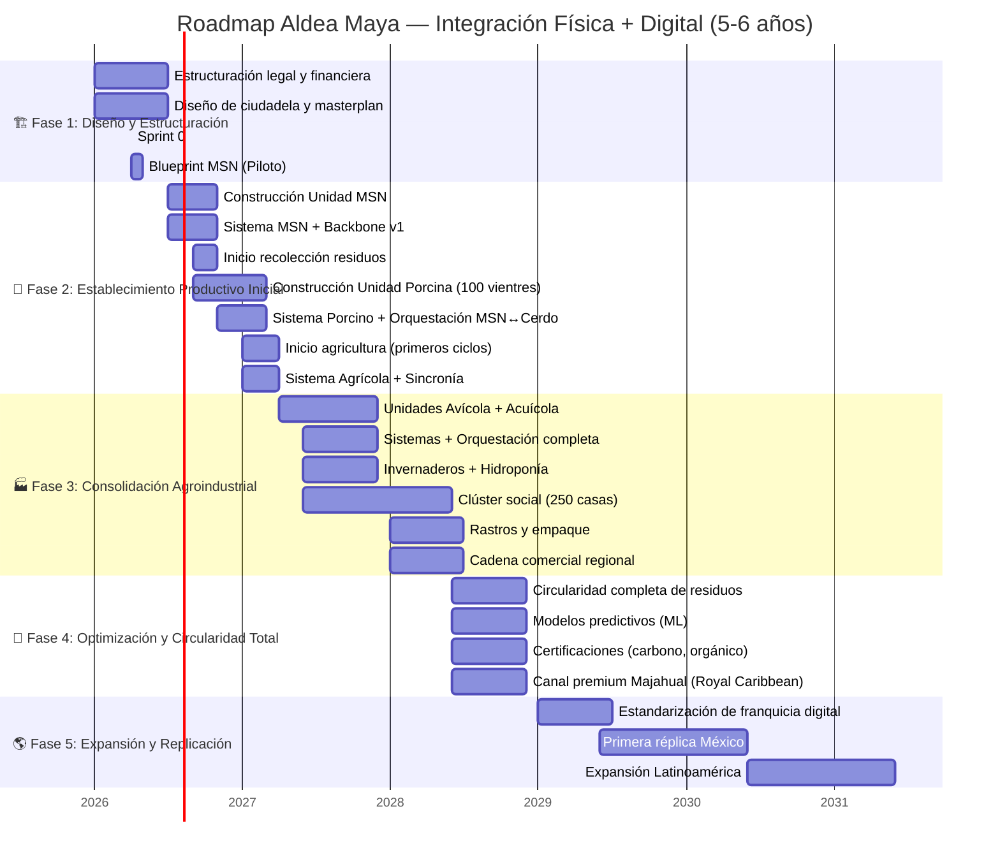
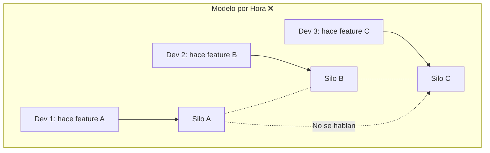
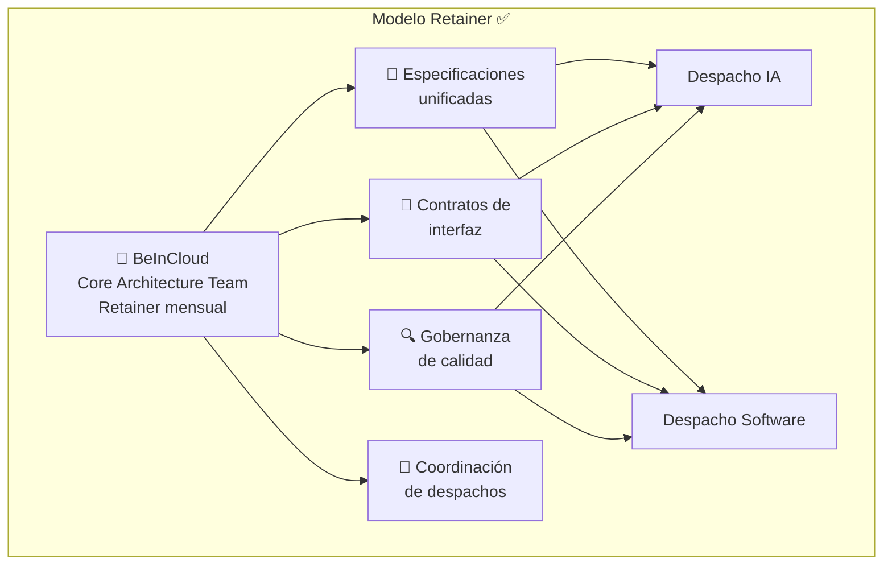
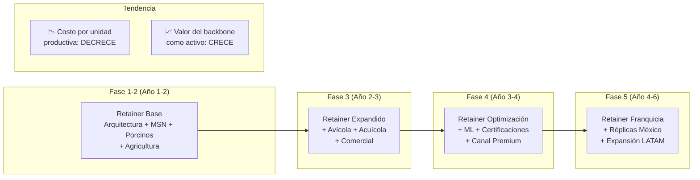
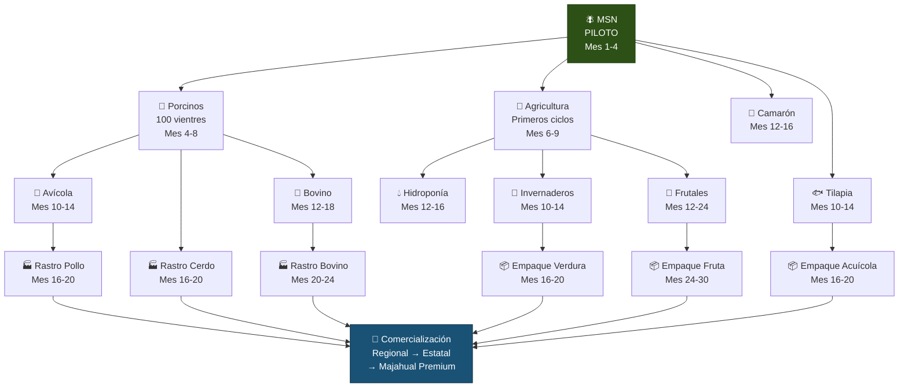
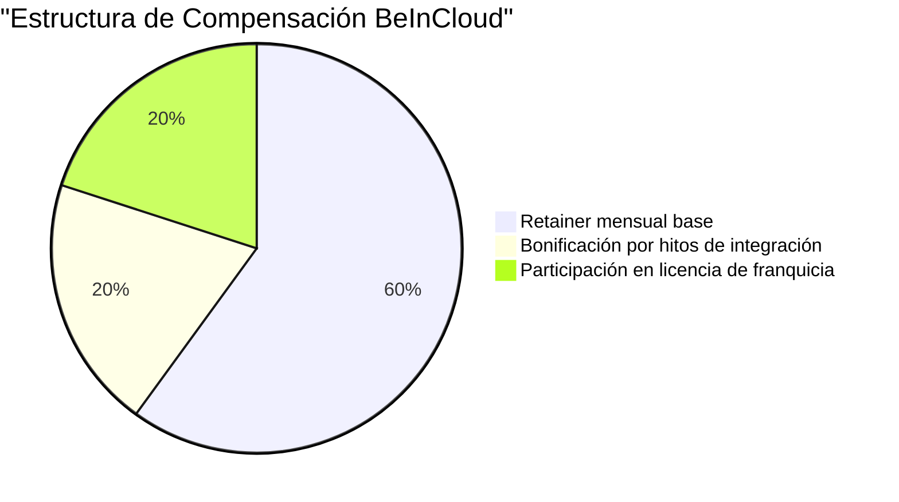
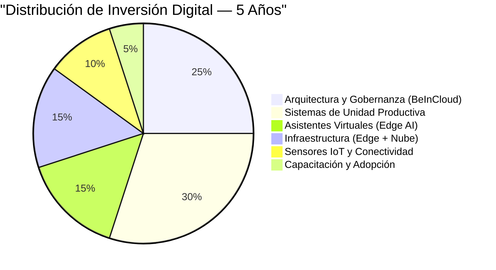

# 📈 05 — Estrategia de Expansión y Modelo de Socio

> *"No es un año, no son dos, ni son tres. Estamos hablando de cinco, seis años."*

---

## 1. Fases de Implementación: Alineadas con la Construcción Física

El backbone digital no tiene roadmap propio. **Su roadmap es el de Aldea Maya.** Cada fase digital se activa cuando la fase física la necesita — ni antes (desperdicio) ni después (caos).

### 1.1 Roadmap Integrado: Físico + Digital



### 1.2 Principio de Alineación

| Regla | Descripción |
|-------|-------------|
| **Digital sigue a Físico** | No se desarrolla sistema para una unidad que no está en construcción |
| **Piloto antes de Escala** | Cada unidad se pilotea con backbone antes de escalar |
| **Valor desde Sprint 1** | Cada sprint entrega valor auditable, no promesas |
| **Incremental, no Big Bang** | El backbone crece unidad por unidad, no todo de golpe |

---

## 2. Modelo de Retainer de Arquitectura

### 2.1 Por Qué un Core Architecture Team

Aldea Maya requiere coordinar múltiples despachos de TI especializados. La alternativa de contratar desarrolladores por hora genera:

- Fragmentación de conocimiento
- Sin visión arquitectónica unificada
- Riesgo de incompatibilidad entre sistemas
- Imposibilidad de mantener estándares de franquicia

El modelo de **Retainer de Arquitectura** resuelve esto:





### 2.2 Qué Incluye el Retainer

| Servicio | Descripción | Frecuencia |
|----------|-------------|:----------:|
| **Arquitectura de backbone** | Diseño y evolución de la capa de orquestación | Continuo |
| **Especificaciones SDD** | Redacción y mantenimiento de specs para cada unidad | Por fase |
| **Contratos de interfaz** | Definición de APIs y eventos entre sistemas | Por integración |
| **Coordinación de despachos** | Alineación técnica entre todos los proveedores de TI | Semanal |
| **Revisión de calidad** | Validación de entregables vs. especificación | Por entregable |
| **Reporte al fondo** | Dashboard de progreso y métricas de TI | Mensual |
| **Evolución arquitectónica** | Adaptación del backbone a nuevas unidades | Trimestral |

### 2.3 Modelo Económico del Retainer



> **Para el fondo**: El retainer no es un costo fijo de TI. Es la inversión en el sistema nervioso que hace que cada dólar en infraestructura física rinda más. El costo por unidad productiva decrece con cada integración.

---

## 3. Estrategia de Expand: De MSN al Mega Hub

### 3.1 Secuencia de Integración al Backbone



### 3.2 Valor Acumulado por Fase

| Fase | Unidades Integradas | Valor del Backbone |
|------|:-------------------:|---------------------|
| **Piloto** | MSN | Prueba de concepto: trazabilidad + auditoría |
| **Fase 2** | MSN + Porcinos + Agricultura | Primera sincronía biológica completa |
| **Fase 3** | + Avícola + Acuícola + Invernaderos | Economía circular operativa |
| **Fase 4** | + Rastros + Empaque + Comercial | Cadena de valor integrada end-to-end |
| **Fase 5** | + Certificaciones + Canal Premium | Máximo valor por producto |
| **Franquicia** | Modelo completo replicable | Activo licenciable |

### 3.3 Canal Premium: Majahual y Royal Caribbean

La salida comercial premium merece mención especial:

- Royal Caribbean adquirió el puerto de Majahual
- 12,000 turistas diarios, 5 millones al año
- Pabellón de restaurantes abastecido por Aldea Maya
- El backbone garantiza trazabilidad de origen para el mercado premium
- Certificación orgánica + regenerativa = precio premium

> **Para el fondo**: El canal Majahual es el multiplicador de valor. Producto trazable + certificado + regenerativo + local = margen premium que justifica toda la inversión en backbone.

---

## 4. Modelo de Socio: La Relación de Largo Plazo

### 4.1 BeInCloud No Es un Proveedor. Es un Socio Arquitectónico.

| Dimensión | Proveedor Tradicional | BeInCloud como Socio |
|-----------|:---------------------:|:--------------------:|
| Relación | Proyecto por proyecto | Retainer de 5-6 años |
| Incentivo | Facturar más horas | Que el backbone genere valor |
| Conocimiento | Se lo lleva al irse | Queda en las specs (SDD) |
| Riesgo | Del cliente | Compartido |
| Éxito | Entregar código | Que Aldea Maya sea replicable |

### 4.2 Skin in the Game

BeInCloud propone un modelo donde parte de la compensación está atada al éxito del territorio:



### 4.3 Transferencia de Conocimiento

El modelo SDD garantiza que Aldea Maya pueda operar sin BeInCloud si lo decide:

| Año | Nivel de Dependencia | Transferencia |
|:---:|:--------------------:|---------------|
| 1 | Alta | BeInCloud diseña y coordina todo |
| 2 | Media-Alta | Equipo interno de Aldea Maya aprende SDD |
| 3 | Media | Equipo interno co-diseña con BeInCloud |
| 4 | Media-Baja | Equipo interno lidera, BeInCloud asesora |
| 5-6 | Baja | Aldea Maya es autónoma, BeInCloud en franquicia |

---

## 5. Economía del Backbone: Números para el Fondo

### 5.1 Estructura de Inversión Digital



### 5.2 Retorno del Backbone

| Fuente de Retorno | Mecanismo | Horizonte |
|--------------------|-----------|:---------:|
| Reducción de merma | Sincronía evita pérdida de insumos y producción | Año 1 |
| Reducción de costo de proteína | MSN vs. harina de pescado importada | Año 1 |
| Precio premium por trazabilidad | Certificación orgánica + regenerativa | Año 2 |
| Eficiencia operativa | Optimización de recursos por datos | Año 2-3 |
| Canal Majahual | Acceso a mercado premium de 5M turistas/año | Año 3 |
| Créditos de carbono | MRV automatizado por el backbone | Año 3-4 |
| Licencia de franquicia | Modelo replicable a otras regiones | Año 4-6 |

### 5.3 Punto de Equilibrio del Backbone

El backbone se autofinancia cuando:

```
Ahorro por sincronía + Prima por trazabilidad + Ingresos por certificación
> Costo del retainer + Costo de infraestructura + Costo de operación
```

Estimación conservadora: **Año 2-3** el backbone genera más valor del que cuesta.

---

## 6. Gobernanza y Transparencia: Compromiso con el Fondo

### 6.1 Reportes Periódicos

| Reporte | Frecuencia | Contenido |
|---------|:----------:|-----------|
| Dashboard operativo | Tiempo real | Estado de cada unidad productiva |
| Reporte de auditoría | Mensual | Trazabilidad financiera completa |
| Reporte de progreso TI | Mensual | Specs completadas, sistemas integrados |
| Reporte de impacto social | Trimestral | Empleos, vivienda, educación |
| Reporte de impacto ambiental | Trimestral | Circularidad, regeneración, emisiones |
| Revisión estratégica | Semestral | Alineación roadmap físico-digital |

### 6.2 Compromiso de Transparencia

> Cada peso invertido en el backbone tiene:
> - Una especificación que lo justifica
> - Un contrato que lo respalda
> - Una métrica que lo mide
> - Un reporte que lo comunica
>
> Sin excepciones. Sin cajas negras. Sin sorpresas.

---

## 7. Próximos Pasos Inmediatos

| # | Acción | Responsable | Plazo |
|---|--------|-------------|:-----:|
| 1 | Constituir grupo de trabajo (WhatsApp + Drive) | Aldea Maya + BeInCloud | Semana 1 |
| 2 | Presentación corporativa BeInCloud al equipo Aldea Maya | BeInCloud | Semana 1 |
| 3 | Acceso al Drive con documentación completa del proyecto | Aldea Maya | Semana 1 |
| 4 | Firma de NDA | Ambas partes | Semana 2 |
| 5 | Acompañamiento para dimensionar TI completo | BeInCloud + Directora de Estrategia | Semana 2-3 |
| 6 | Blueprint MSN (4 semanas) | BeInCloud | Semana 3-6 |
| 7 | Precotización de Fase 1 | BeInCloud | Semana 6-8 |

---

*Documento vivo. Versión 0.1 — Sprint 0, Abril 2026*
*BeInCloud — Arquitectos de Sistemas Nerviosos Territoriales*
