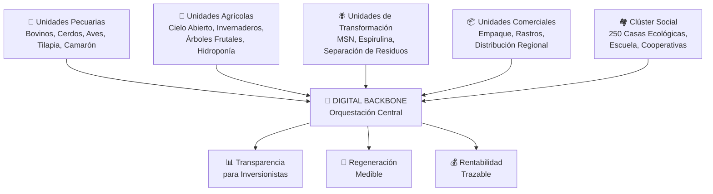

# 🌿 Aldea Maya — Digital Backbone

### El Manifiesto de Orquestación

> *"No construimos software. Orquestamos el sistema nervioso de una ciudadela agroindustrial regenerativa de 1,800 hectáreas."*

---

## BeInCloud Ya Está Trabajando

Este repositorio no es una propuesta. Es el Sprint 0 del **Digital Backbone** de Aldea Maya — el primer entregable tangible de la capa de orquestación que conectará más de 20 unidades productivas y de transformación en un solo organismo agroindustrial.

BeInCloud puede fungir como el **arquitecto del sistema nervioso central** de la ciudadela más ambiciosa de Latinoamérica, integrando gobernanza, especificación Spec-Driven y su capacidad como software factory — FinOps, desarrollo Cloud-Native, IA y Media Suite — en un solo servicio de orquestación territorial.

---

## La Visión 70-en-1

La Dirección Estratégica de Aldea Maya lo definió con claridad: *"Tú tienes 70 clientes en uno."*

Aldea Maya no es un cliente con un requerimiento. Es un ecosistema donde convergen:



Cada una de estas unidades tiene un líder especialista, un ciclo biológico propio y una interdependencia crítica con las demás. El backbone no las controla — las **sincroniza**.

---

## El Rol del Digital Backbone

El backbone es la capa de orquestación que garantiza que:

| Función | Sin Backbone | Con Backbone |
|---------|:------------:|:------------:|
| Sincronía entre ciclos biológicos | Manual, propensa a error | Automatizada, en tiempo real |
| Trazabilidad del recurso del fondo | Reportes manuales mensuales | Auditoría continua, transparente |
| Coordinación de 22+ aliados | WhatsApp y llamadas | Flujos de orquestación formales |
| Escalabilidad a franquicia | Imposible de replicar | Estandarizada desde el día 0 |
| Captura de datos en campo | Papel y Excel | Asistentes virtuales en piso (Edge AI) |

---

## Compromiso de Gobernanza: Activo Replicable, No Gasto Operativo

El backbone se diseña bajo la metodología **Spec-Driven Development (SDD)**, que garantiza:

1. **La especificación es más valiosa que el código.** Aldea Maya es dueña perpetua de su conocimiento digital.
2. **Eliminación del riesgo de persona.** Ningún despacho, incluyendo BeInCloud, es indispensable.
3. **Estándares de franquicia.** Cada decisión arquitectónica se toma pensando en la replicabilidad a nivel México y Latinoamérica.
4. **Auditorías mensuales.** La estructura de datos está diseñada para ser audit-ready desde el Sprint 0.

---

## Estructura del Repositorio

```
Aldea-Maya-Digital-Backbone/
├── README.md                          ← Este manifiesto
├── 01-business-alignment.md           ← Sincronía biológica y operativa
├── 02-architecture-ecosystem.md       ← Arquitectura de datos y transparencia
├── 03-sdd-methodology.md              ← Software como activo financiero (SDD + IA)
├── 04-blueprint-msn.md                ← Proyecto piloto: Unidad MSN
├── 05-roadmap-economics.md            ← Estrategia de expansión y modelo de socio
├── assets/
│   ├── beincloud-profile.md           ← Perfil corporativo de BeInCloud
│   └── presentation-summary.md        ← Resumen ejecutivo del PDF (Feb 2026)
└── .kiro/
    └── steering/
        └── business-over-technology.md ← Regla maestra del proyecto
```

---

## Para el Fondo de Inversión

Si estás leyendo esto desde el fondo, la pregunta no es *"¿cuánto cuesta el software?"*

La pregunta es: **¿Cómo garantizas que cada dólar invertido en 1,800 hectáreas sea trazable, auditable y genere retorno compuesto?**

La respuesta es el Digital Backbone.

→ Empieza por [`01-business-alignment.md`](./01-business-alignment.md) para ver que entendemos el campo.
→ Sigue con [`04-blueprint-msn.md`](./04-blueprint-msn.md) para ver el primer entregable concreto.
→ Cierra con [`05-roadmap-economics.md`](./05-roadmap-economics.md) para ver la relación de largo plazo.

---

**BeInCloud** — Arquitectos de Sistemas Nerviosos Territoriales
*Sprint 0 — Abril 2026*
