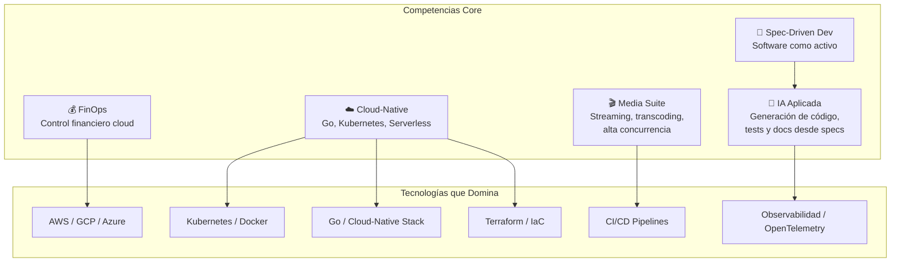

# 🏢 BeInCloud — Perfil Corporativo

> *"No vendemos horas. No hacemos aumento de personal. Entregamos ingeniería con impacto financiero."*

---

## Identidad

| Campo | Detalle |
|-------|---------|
| **Razón Social** | Be In Cloud Group LLC |
| **Sitio Web** | [beincloud.net](https://beincloud.net) |
| **Sede Principal** | Hollywood, Florida, EE. UU. — 1934 Wilson St, Hollywood, FL 33020 |
| **Oficina LATAM** | Buenos Aires, Argentina — Avenida Del Libertador 1000, Vicente López |
| **Oficina Venezuela** | Valencia, Venezuela — C.C Reda Building, Valencia 2001, Carabobo |
| **Posicionamiento** | Critical Cloud Engineering — Ingeniería Cloud con visión financiera |

---

## Tres Pilares de Servicio

### 1. FinOps — Control Financiero y ROI Cloud

BeInCloud aborda el problema más común en la nube: la factura que crece más rápido que los ingresos.

| Capacidad | Detalle |
|-----------|---------|
| Reducción de costos cloud | 30-50% garantizado en 90 días |
| Panel de control en tiempo real | Visibilidad exacta de dónde va cada dólar |
| Alertas automáticas de sobrecostos | Detección proactiva de desperdicios |
| Reportes ejecutivos automáticos | Para CFOs y fondos de inversión |
| Recomendaciones de optimización | Basadas en datos, no en opiniones |

**Relevancia para Aldea Maya**: FinOps es la disciplina que garantiza que la infraestructura digital del backbone no se convierta en un gasto descontrolado. Cada peso en nube es trazable y justificado.

---

### 2. Software Factory — Desarrollo Spec-Driven con IA

BeInCloud no solo escribe código. Diseña especificaciones de alta precisión que un motor de IA transforma en software listo para producción.

| Capacidad | Detalle |
|-----------|---------|
| Metodología Spec-Driven Development (SDD) | La especificación es el activo, el código es la implementación |
| Velocidad de entrega | 2x vs. desarrollo tradicional |
| Foco tecnológico | Go & Cloud-Native |
| Seguridad y escalabilidad | Nativas en cada entrega |
| Validación experta | Ingenieros senior en cada ciclo |
| Motor de IA | Genera código, tests y documentación desde la spec |

**Relevancia para Aldea Maya**: SDD garantiza que Aldea Maya sea dueña perpetua de su conocimiento digital. La IA acelera el desarrollo y elimina el riesgo de persona.

---

### 3. Infraestructura de Alta Disponibilidad — Media Suite & Cloud-Native

Arquitecturas probadas en plataformas de streaming masivo con millones de transacciones diarias.

| Capacidad | Detalle |
|-----------|---------|
| Alta escala | 100,000+ usuarios concurrentes |
| Uptime | 99.99% en plataformas de streaming masivo |
| Transcoding optimizado | Reducción de costos de video en 40% |
| Migraciones | 0 downtime en migraciones cloud |
| Pipelines de video | 10x más streams concurrentes sin caídas |

**Relevancia para Aldea Maya**: La experiencia en alta disponibilidad y arquitecturas distribuidas se traduce directamente en un backbone territorial resiliente que opera 24/7 con edges zonales autónomos.

---

## Especialidades Técnicas

---

## Resultados Comprobados

| Métrica | Resultado |
|---------|-----------|
| Usuarios concurrentes soportados | 100,000+ |
| Visibilidad de costos cloud | 100% |
| Downtime en migraciones | 0 |
| Reducción de costos AWS (caso FinTech) | 45% en 2 meses |
| Streams concurrentes (caso OTT) | 10x incremento sin caídas |
| Reducción de costos de transcoding | 40% |

---

## Clientes y Testimonios

- **CTO, Empresa FinTech**: Reducción de costos AWS en 45% en 2 meses. ROI inmediato.
- **VP de Ingeniería, Plataforma OTT**: Pipelines de video procesando 10x más streams concurrentes. Transcoding optimizado con reducción de costos del 40%.
- **CFO, Empresa de Comercio Electrónico**: Visibilidad completa de gastos en la nube con panel de control en tiempo real.

---

## Modelo de Trabajo

| Principio | Descripción |
|-----------|-------------|
| **No vendemos horas** | Entregamos ingeniería con impacto financiero medible |
| **No hacemos staff augmentation** | Somos socios arquitectónicos, no cuerpos en sillas |
| **Spec-first** | La especificación se escribe antes que el código |
| **IA como acelerador** | La IA genera, el ingeniero valida y refina |
| **FinOps nativo** | El control de costos no es un add-on, es parte del ADN |

---

## Por Qué BeInCloud para Aldea Maya

| Capacidad BeInCloud | Aplicación en Aldea Maya |
|---------------------|--------------------------|
| FinOps | Control de costos de infraestructura digital del backbone |
| Spec-Driven Development | Gobernanza de activos digitales, eliminación de riesgo de persona |
| IA aplicada | Aceleración de desarrollo, generación de tests y documentación |
| Cloud-Native | Arquitectura distribuida edge + nube para 1,800 hectáreas |
| Media Suite | Experiencia en alta disponibilidad para backbone 24/7 |
| Alta escala | Preparación para franquicia y réplicas LATAM |

BeInCloud no ofrece solo una de estas capacidades. Ofrece **las cinco integradas** en un modelo de retainer que acompaña a Aldea Maya durante los 5-6 años de implementación.

---

*Fuente: [beincloud.net](https://beincloud.net) — Consultado Abril 2026*
*Be In Cloud Group LLC*
